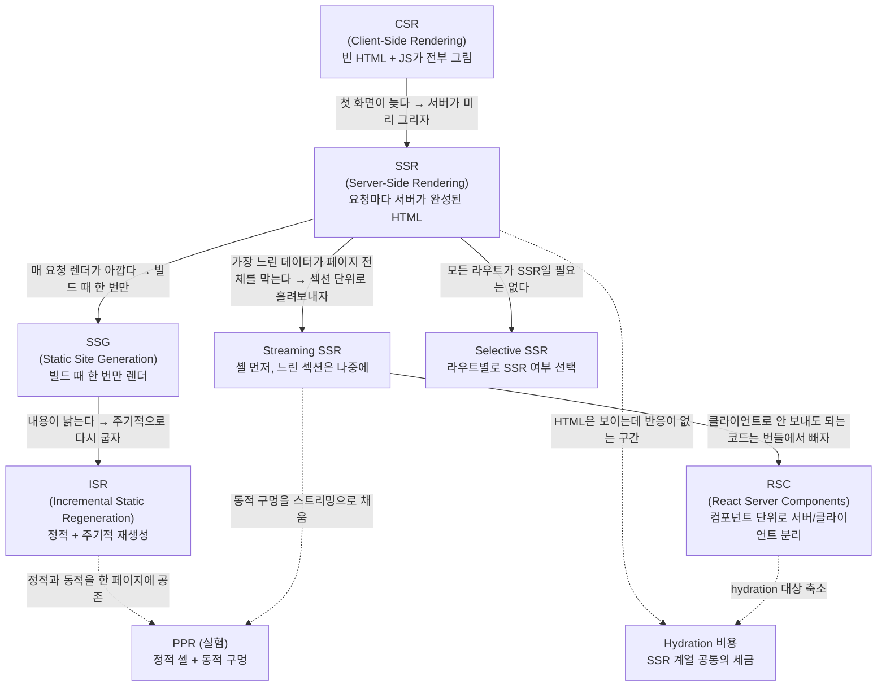

# 00. 전체 개념도와 학습 경로

> **한 줄 요약**: 렌더링 전략은 결국 두 개의 축 — "**언제** 렌더하나(빌드/요청/클라이언트)" × "**얼마나 잘게 쪼개나**(페이지/섹션/컴포넌트)" — 위의 좌표이며, 이 문서는 그 지도와 권장 학습 순서를 제공한다.
>
> **선행 문서**: 없음 (여기서 시작)

## 렌더링 전략 개념도

CSR에서 출발해 각 전략이 **직전 전략의 어떤 문제를 풀려고 등장했는지**를 따라가면 전체 체계가 하나의 이야기로 읽힌다.

## 두 개의 축

| | **페이지 전체** | **섹션 단위** | **컴포넌트 단위** |
|---|---|---|---|
| **빌드 시(build time)** | SSG · ISR ([04](./04-ssg-isr.md)) | PPR의 정적 셸 ([10](./10-ppr-islands-resumability.md)) | — |
| **요청 시(request time)** | 블로킹 SSR ([03](./03-ssr.md)) | Streaming SSR ([05](./05-streaming-ssr.md)) · deferred loader ([09](./09-selective-ssr-and-router-caching.md)) | RSC ([06](./06-rsc.md)) · 선택적 hydration ([07](./07-hydration.md)) |
| **클라이언트(client)** | CSR ([02](./02-csr.md)) | 코드 분할(code splitting) ([08](./08-client-rendering-optimizations.md)) | `React.lazy` · memo · 가상화 ([08](./08-client-rendering-optimizations.md)) |

> 축은 "**초기 HTML/콘텐츠를 언제 만드나**" 기준이다. 선택적 hydration([07](./07-hydration.md))과 memo·가상화([08](./08-client-rendering-optimizations.md))는 생성 시점이 아니라 **생성 이후의 상호작용/재렌더 비용**을 줄이는 기법인데, 다루는 단위가 같아서 편의상 해당 칸에 두었다.

진화의 방향은 대체로 두 가지다.

1. **위로**: 가능한 것은 미리(빌드 때), 서버에서 렌더한다 → 첫 바이트 도달(TTFB)·첫 콘텐츠 페인트(FCP)가 좋아진다(지표 정의는 [01](./01-rendering-pipeline-and-metrics.md)).
2. **오른쪽으로**: 페이지를 통째로 다루지 않고 잘게 쪼갠다 → 가장 느린 조각이 전체를 볼모로 잡지 못한다.

## 학습 경로 (권장 순서와 이유)

| 순서 | 문서 | 왜 이 순서인가 |
|---|---|---|
| 1 | [01. 렌더링 파이프라인과 지표](./01-rendering-pipeline-and-metrics.md) | TTFB/FCP/LCP/TTI/INP를 모르면 데모의 숫자를 읽을 수 없다. HUD 단계와 지표의 대응표가 여기 있다. |
| 2 | [02. CSR](./02-csr.md) | 모든 전략의 출발점이자 비교 기준선(baseline). |
| 3 | [03. SSR](./03-ssr.md) | CSR의 첫 화면 문제를 푸는 첫 번째 답. |
| 4 | [07. Hydration](./07-hydration.md) | SSR을 배우자마자 그 숨은 비용을 알아야 한다. 04~06을 이해하는 열쇠. |
| 5 | [04. SSG와 ISR](./04-ssg-isr.md) | "요청 시"를 "빌드 시"로 옮기는 축. |
| 6 | [05. Streaming SSR](./05-streaming-ssr.md) | "페이지"를 "섹션"으로 쪼개는 축. |
| 7 | [06. RSC](./06-rsc.md) | "섹션"을 "컴포넌트"로 쪼개고 번들에서 서버 코드를 제거. |
| 8 | [08. 클라이언트 렌더링 최적화](./08-client-rendering-optimizations.md) | 어떤 전략을 쓰든 클라이언트에서 끝나는 싸움. 프레임워크 무관. |
| 9 | [09. Selective SSR과 라우터 캐싱](./09-selective-ssr-and-router-caching.md) | TanStack Start 고유 기능. SPA 내비게이션의 체감 속도. |
| 10 | [11. Next vs Start](./11-next-vs-start.md) | 핵심 문서. 같은 문제를 두 프레임워크가 어떻게 다르게 푸는지. 미러 데모 쌍과 함께. |
| 11 | [10. PPR · Islands · Resumability](./10-ppr-islands-resumability.md) | 개념 전용(데모 없음). 최전선이 어디로 가는지. |
| 12 | [12. 네트워크 조건](./12-network-conditions.md) | 전략의 유불리가 회선에 따라 뒤집히는 것을 확인. |
| 13 | [13. WebView 성능](./13-webview-performance.md) | RN 웹뷰라는 특수 환경. |
| 14 | [14. 측정 방법론](./14-measurement-methodology.md) | 사실 **데모를 보기 전에 훑고, 다 본 뒤에 정독**하기를 권한다. 재는 법이 틀리면 전부 무효다. |

각 문서 말미의 "**다음 문서**" 링크는 번호순이 아니라 **이 학습 경로 순서**를 따른다.

## 문서 색인

| 문서 | 주제 |
|---|---|
| [01-rendering-pipeline-and-metrics.md](./01-rendering-pipeline-and-metrics.md) | 브라우저 파이프라인, React 렌더/커밋, 지표 정의, HUD 대응표 |
| [02-csr.md](./02-csr.md) | Client-Side Rendering |
| [03-ssr.md](./03-ssr.md) | Server-Side Rendering |
| [04-ssg-isr.md](./04-ssg-isr.md) | Static Site Generation · Incremental Static Regeneration |
| [05-streaming-ssr.md](./05-streaming-ssr.md) | Streaming SSR과 Suspense |
| [06-rsc.md](./06-rsc.md) | React Server Components |
| [07-hydration.md](./07-hydration.md) | Hydration이 왜 비용인가 |
| [08-client-rendering-optimizations.md](./08-client-rendering-optimizations.md) | 코드 분할, useTransition, memo, 가상화, 워터폴 제거 |
| [09-selective-ssr-and-router-caching.md](./09-selective-ssr-and-router-caching.md) | Start의 ssr 옵션, 라우터 캐시, preload |
| [10-ppr-islands-resumability.md](./10-ppr-islands-resumability.md) | PPR, Astro Islands, Qwik Resumability (개념 전용) |
| [11-next-vs-start.md](./11-next-vs-start.md) | Next.js vs TanStack Start 철학·기능 비교 |
| [12-network-conditions.md](./12-network-conditions.md) | 회선 프로파일별 전략 유불리 매트릭스 |
| [13-webview-performance.md](./13-webview-performance.md) | RN WebView 특성과 측정 절차 |
| [14-measurement-methodology.md](./14-measurement-methodology.md) | 공정 비교 원칙 |

## 데모 색인

전체 데모 맵(경로 × 보는 지표 × 위키 링크)은 [루트 README](../../README.md#전체-데모-맵)에 있다. 요약:

- **next-lab (3000)**: [/csr-vs-ssr](http://localhost:3000/csr-vs-ssr/as-is) · [/blocking-vs-streaming](http://localhost:3000/blocking-vs-streaming/as-is) · [/rendering-modes](http://localhost:3000/rendering-modes/ssr) · [/rsc-payload](http://localhost:3000/rsc-payload/as-is)
- **start-lab (3001)**: [/loader-vs-client](http://localhost:3001/loader-vs-client/as-is) · [/blocking-vs-deferred](http://localhost:3001/blocking-vs-deferred/as-is) · [/selective-ssr](http://localhost:3001/selective-ssr/full) · [/cache-preload](http://localhost:3001/cache-preload/as-is)
- **react-lab (3002)**: [/#/transition](http://localhost:3002/#/transition/as-is) · [/#/memo](http://localhost:3002/#/memo/as-is) · [/#/virtual](http://localhost:3002/#/virtual/as-is) · [/#/waterfall](http://localhost:3002/#/waterfall/as-is) · [/bundle-as-is.html](http://localhost:3002/bundle-as-is.html)
- **rn-webview**: Expo 앱 — [13. WebView 성능](./13-webview-performance.md) 절차 참고

---

**다음 문서**: [01. 렌더링 파이프라인과 지표](./01-rendering-pipeline-and-metrics.md)
