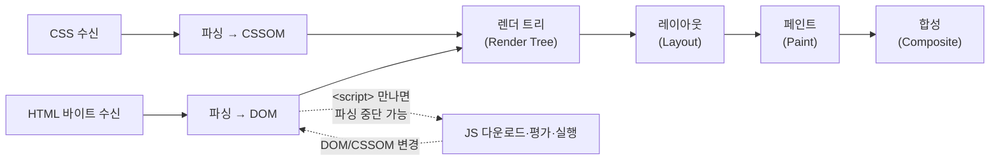

# 01. 렌더링 파이프라인과 지표

> **한 줄 요약**: 브라우저가 바이트를 픽셀로 바꾸는 파이프라인과 React의 렌더/커밋 단계를 이해하면, TTFB/FCP/LCP/TTI/INP가 각각 "파이프라인의 어느 지점"인지 — 그리고 PerfHUD의 각 단계가 무엇을 재는지 — 알 수 있다.
>
> **선행 문서**: [00. 전체 개념도](./00-index.md)

## 브라우저 렌더링 파이프라인

핵심 사실 세 가지:

1. **첫 픽셀은 HTML+CSS만으로도 나올 수 있다.** 서버가 콘텐츠가 담긴 HTML을 주면 JS 없이도 화면이 뜬다(SSR 계열의 근거).
2. **JS는 파서를 막을 수 있고, 실행 자체가 메인 스레드를 점유한다.** 번들이 크면 다운로드+평가(`js-eval`)+실행이 전부 비용이다.
3. **파이프라인은 반복된다.** JS가 DOM을 바꾸면 레이아웃→페인트가 다시 돈다. 잦은 대규모 변경은 곧 [long task](#지표-정의)다.

## React의 렌더(render)와 커밋(commit)

React의 작업은 두 단계로 나뉜다.

- **렌더 단계**: 컴포넌트 함수를 호출해 "다음 화면의 설계도"(virtual DOM)를 만들고 이전 설계도와 비교(reconciliation)한다. 중단·재개 가능(concurrent rendering).
- **커밋 단계**: 계산된 차이를 실제 DOM에 반영하고 effect를 실행한다. 중단 불가.

렌더 단계가 길면 메인 스레드가 잠겨 입력 반응이 밀리고(INP 악화), 커밋이 크면 레이아웃/페인트 비용이 커진다. [08. 클라이언트 렌더링 최적화](./08-client-rendering-optimizations.md)의 모든 기법은 이 두 단계 중 하나를 줄이는 것이다.

## Hydration은 왜 별도 비용인가 (예고편)

SSR이 보낸 HTML은 **보이기만 하고 반응하지 않는다**. React가 클라이언트에서 컴포넌트 트리를 한 번 더 구성하고 기존 DOM에 이벤트를 연결하는 과정이 hydration이며, 이는 사실상 **한 번 더 렌더하는 것과 비슷한 CPU 비용**이다. 자세한 것은 [07. Hydration](./07-hydration.md).

## 지표 정의

| 지표 | 풀네임 | 정의 | 무엇이 나쁘게 만드나 |
|---|---|---|---|
| **TTFB** | Time To First Byte | 내비게이션 시작 → 응답 첫 바이트 | 서버 렌더 시간, 서버측 데이터 페치, 회선 왕복 지연(RTT) |
| **FCP** | First Contentful Paint | 첫 텍스트/이미지가 그려진 시점 | 빈 HTML(CSR), 렌더 차단 리소스, 느린 TTFB |
| **LCP** | Largest Contentful Paint | 가장 큰 콘텐츠 요소가 그려진 시점 (갱신형 — 더 큰 요소가 나오면 값이 바뀜) | 주 콘텐츠가 JS/데이터 도착을 기다림 |
| **TTI** | Time To Interactive | 화면이 뜨고 **안정적으로 반응 가능**해진 시점 | 큰 번들 평가, hydration, long task 연발 |
| **INP** | Interaction to Next Paint | 상호작용 → 다음 페인트까지의 지연(필드 지표). 페이지 수명 전체에서 **클릭/탭/키 입력만** 집계한 거의-최악 값(상호작용이 많으면 ≈98퍼센타일) — hover·scroll은 제외 | 무거운 이벤트 핸들러, 거대한 동기 리렌더 |
| **TBT** | Total Blocking Time | FCP~TTI 사이 50ms 초과 long task들의 초과분 합 | 위와 동일 (TTI/INP의 lab 대리 지표) |

> TTI는 Lighthouse 10(2023)부터 리포트에서 제거(deprecated)되어 현재 도구에서는 직접 볼 수 없다 — 여기서는 개념 설명용이며, lab에서는 TBT가 그 자리를 대신한다.

## PerfHUD 단계 ↔ 지표 대응표

HUD가 자동 수집하는 단계([docs/PERF_API.md](../PERF_API.md) 참고)와 표준 지표의 대응:

| HUD 단계 | 대응 지표 | 비고 |
|---|---|---|
| `nav-start` | — | 모든 단계의 기준점(0ms) |
| `ttfb` | TTFB | `responseStart` |
| `fcp` | FCP | |
| `lcp` | LCP | **갱신형** — 마지막 값을 읽을 것 |
| `dom-content-loaded` / `load` | — | 문서 이벤트. 참고용 |
| `js-eval` | — | 번들 평가 시작(계측용 컴포넌트 `HydrationMarker`의 모듈 평가 시점에 기록). 번들 크기 체감 지점 |
| `hydrated` | ≈ TTI 하한 | hydration 완료. 이 전까지 SSR 화면은 반응하지 않음 |
| `long-tasks` | TBT **상한** 근사 | 갱신형. 50ms 초과 작업의 **전체 duration** 누적(내비게이션 시작부터, FCP 이전 포함) — 초과분(duration−50ms)만 세는 TBT보다 항상 크게 나온다 |
| `worst-interaction` | INP 근사 | 갱신형. 최악 상호작용 지연 — 40ms 미만 상호작용은 아예 기록되지 않음 |
| `stream:<이름>` | — | StreamMark: 해당 HTML 조각이 **파서에 도달한 시점**(hydration 이전) |
| (임의 이름) | — | StageMark: 컴포넌트 **마운트 시점**에 기록하는 일반 단계 마크 — StreamMark와 달리 hydration 이후에 발화 |
| `data-requested` / `data-received` | — | 커스텀 규약: 클라이언트 데이터 요청 시작/수신 |
| `content-rendered` | ≈ LCP 근처 | 커스텀 규약: 주 콘텐츠가 커밋된 뒤 effect에서 기록 |
| `section-1..N` | — | 지연 섹션의 완료 시점 네이밍 규약 — 현재 데모들은 StreamMark로 기록하므로 HUD에는 `stream:section-N`으로 찍힘 |

**TTI는 HUD에 직접 없다.** `hydrated` 이후 `long-tasks`가 더 이상 갱신되지 않는 시점으로 근사해서 읽는다.

## 이 대응표를 읽는 법 — 전략별 시그니처

| 전략 | 전형적인 HUD 패턴 |
|---|---|
| CSR | `ttfb` 빠름 → `fcp` 빠르지만 **빈 셸** → `data-received` 늦음 → `content-rendered`(≈LCP) 늦음 |
| 블로킹 SSR | `ttfb`가 데이터만큼 늦음 → `fcp`≈`lcp` 동시에 콘텐츠 → `hydrated`까지 무반응 구간 |
| 스트리밍 SSR | `ttfb` 빠름 → `fcp` 빠름(셸) → `stream:section-N`이 순차 도착 |
| SSG | `ttfb` 항상 빠름(렌더가 빌드 때 끝남) |

---

**관련 데모**
- 아무 데모나 열고 HUD의 단계 이름에 마우스를 올려 설명을 확인: [http://localhost:3000/csr-vs-ssr/as-is](http://localhost:3000/csr-vs-ssr/as-is)
- 계측 API 계약: [docs/PERF_API.md](../PERF_API.md)

**다음 문서**: [02. CSR](./02-csr.md)
