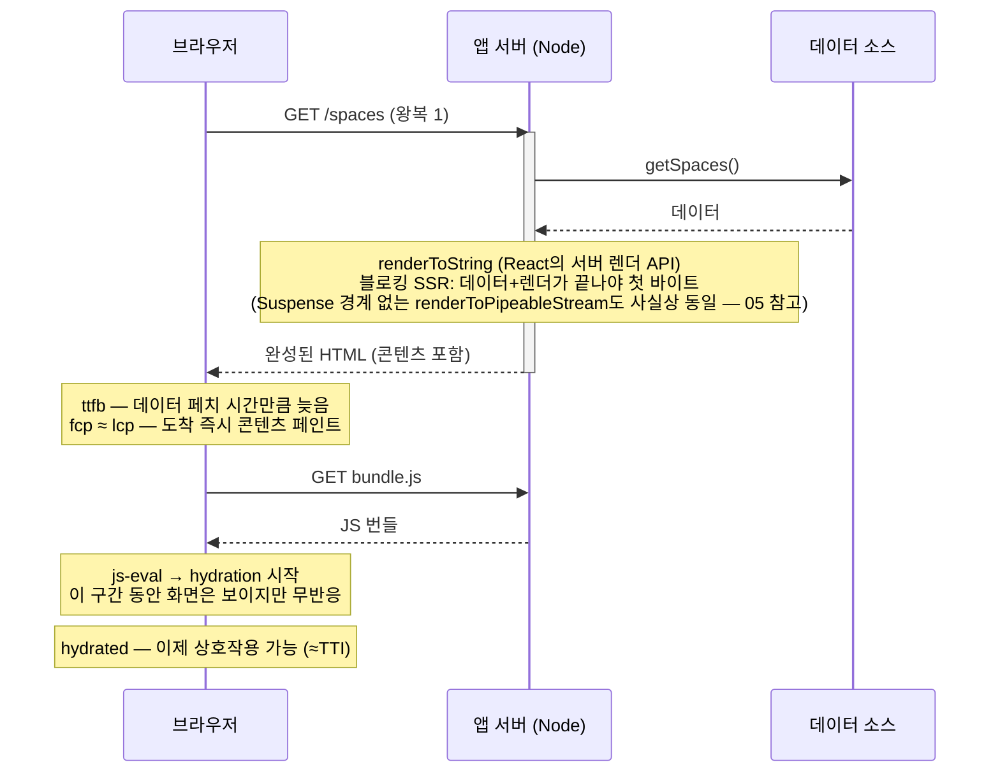

# 03. SSR — Server-Side Rendering

> **한 줄 요약**: 요청이 올 때마다 서버가 데이터를 모아 완성된 HTML을 만들어 보내는 방식 — 첫 화면(FCP/LCP)은 극적으로 빨라지지만, 지연이 TTFB로 이동하고 hydration이라는 새 비용이 생긴다.
>
> **선행 문서**: [02. CSR](./02-csr.md)

## 동작 원리

CSR과의 결정적 차이 두 가지:

1. **데이터 페치가 서버 안에서 일어난다.** 서버↔데이터 소스는 보통 같은 데이터센터라 사용자 회선의 RTT를 타지 않는다. 왕복 3회(HTML→JS→API)가 1회로 줄어든다.
2. **지연이 사라지지 않고 TTFB로 이동한다.** 데이터가 느리면 사용자는 **흰 화면**으로 기다린다(스피너조차 없다). 이것이 [05. Streaming SSR](./05-streaming-ssr.md)이 등장한 이유다.

## 유리한 상황

- **첫 방문 콘텐츠가 핵심**: 목록/상세/글 — 사용자가 오자마자 봐야 하는 것.
- **SEO·소셜 미리보기**가 필요한 모든 페이지.
- **느린 기기 + 괜찮은 회선**: 렌더 비용을 서버가 대신 내준다 (단, hydration 비용은 남는다 — [07](./07-hydration.md)).

## 불리한 상황

- **데이터가 느린 페이지**: TTFB가 데이터에 정비례로 볼모잡힌다. `?apiDelay=2000`이면 흰 화면 2초.
- **개인화가 없고 갱신이 드문 페이지**: 매 요청 렌더는 낭비 → [04. SSG/ISR](./04-ssg-isr.md).
- **상호작용 밀도가 높은 앱 화면**: 어차피 hydration을 다 해야 한다면 SSR의 이득이 작다 → [09. Selective SSR](./09-selective-ssr-and-router-caching.md).

## 전형적 함정

1. **"SSR이면 빠르다"는 착각**: 데이터가 느리면 CSR보다 **체감이 더 나쁠 수 있다**. CSR은 스피너라도 보여주지만 블로킹 SSR은 흰 화면이다.
2. **Hydration mismatch**: 서버와 클라이언트 렌더 결과가 다르면(시간, 난수, 브라우저 전용 API) React가 경고를 내고 최악의 경우 트리를 다시 그린다 → [07. Hydration](./07-hydration.md).
3. **서버 비용·확장성**: 요청마다 CPU로 렌더한다. 트래픽이 몰리면 TTFB가 다시 늘어난다(렌더 큐잉).
4. **uncanny valley**: 화면은 보이는데 클릭이 안 되는 `fcp`~`hydrated` 구간. 사용자는 "버벅인다"고 느낀다.

## 관련 데모

| 데모 | URL | 확인할 것 |
|---|---|---|
| Next SSR (to-be) | [http://localhost:3000/csr-vs-ssr/to-be](http://localhost:3000/csr-vs-ssr/to-be) | `fcp` 스냅샷에 이미 콘텐츠가 있음. `apiDelay` 프리셋을 올리면 `ttfb`가 정비례로 밀림 |
| CSR 대조군 | [http://localhost:3000/csr-vs-ssr/as-is](http://localhost:3000/csr-vs-ssr/as-is) | 같은 지연이 `data-received`에서 나타남 — 지연의 "위치 이동" 관찰 |
| Next 렌더링 모드 | [http://localhost:3000/rendering-modes/ssr](http://localhost:3000/rendering-modes/ssr) | SSG/ISR과의 TTFB 비교 기준점 |
| Start 로더 SSR (미러 쌍) | [http://localhost:3001/loader-vs-client/to-be](http://localhost:3001/loader-vs-client/to-be) | route loader가 서버에서 실행됨. Next 방식과의 차이는 [11](./11-next-vs-start.md) |

**실험 순서 제안**: DevTools Network를 `Slow 3G`로 걸고 as-is/to-be를 다시 비교해 보라. 회선이 느릴수록 왕복 횟수 차이(3회 vs 1회)가 지배적이 되어 SSR의 우위가 커진다 — [12. 네트워크 조건](./12-network-conditions.md). 반대로 `hydrated`가 얼마나 늦는지도 함께 보라. SSR의 청구서는 거기에 있다.

---

**다음 문서**: [07. Hydration](./07-hydration.md) — SSR의 숨은 청구서를 먼저 확인한 뒤 [04. SSG와 ISR](./04-ssg-isr.md)로 넘어간다.
