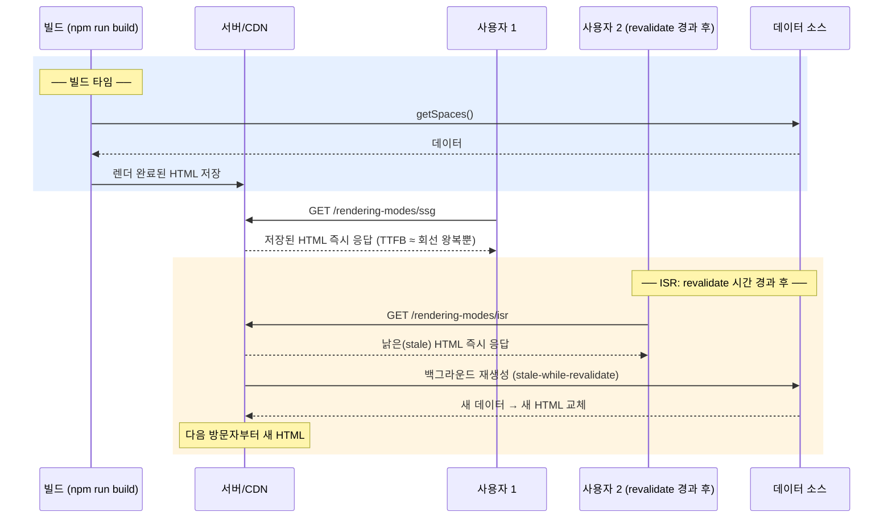

# 04. SSG와 ISR — 빌드 시 렌더링

> **한 줄 요약**: 렌더 시점을 "요청 시"에서 "빌드 시"로 옮기면 TTFB가 데이터 속도와 완전히 분리된다(SSG) — 대신 낡는 콘텐츠 문제가 생기고, ISR은 그것을 "주기적 재생성"으로 절충한다.
>
> **선행 문서**: [03. SSR](./03-ssr.md)

## 동작 원리

렌더를 빌드 타임으로 옮기면 요청 시점에는 파일 서빙만 남는다 — TTFB에서 서버 렌더와 데이터 페치 항이 통째로 사라지는 대신, 화면은 빌드 시점의 데이터에 고정된다. ISR은 그 고정을 "주기적 재생성"으로 푼다.

- **SSG (Static Site Generation)**: 빌드 때 한 번 렌더. 이후 모든 요청은 파일 서빙이다. Next에서는 페이지가 동적 입력(요청별 데이터)을 안 쓰면 기본으로 정적화된다.
- **ISR (Incremental Static Regeneration)**: SSG + `revalidate: N초`. 응답은 항상 즉시(캐시된 HTML), 갱신은 백그라운드에서. **"지금 요청한 사람"이 아니라 "다음 사람"이 새 데이터를 본다**는 것이 핵심 트레이드오프.

## 유리한 상황

- **모든 사용자에게 같은 화면**: 마케팅 페이지, 문서, 블로그, 상품 카탈로그(재고 제외).
- **갱신 주기가 분·시간 단위로 느슨한 데이터**: ISR로 "정적의 속도 + 준신선한 데이터".
- **트래픽 폭증**: 렌더가 없으니 CDN이 전부 받아낸다.

## 불리한 상황

- **개인화·요청별 데이터**: 쿠키/세션에 따라 다른 화면은 정적화 자체가 불가능.
- **실시간성**: 좌석 잔여 수(`seatsAvailable`)처럼 초 단위로 변하는 값. ISR로도 "낡은 값 노출 구간"이 반드시 존재한다.
- **페이지 수 폭발**: 수십만 상세 페이지를 전부 빌드하면 빌드 시간이 폭증한다(`generateStaticParams`로 인기 페이지만 미리 굽고, 나머지는 `dynamicParams`로 첫 요청 시 on-demand 생성하는 조합이 필요).

## 전형적 함정

1. **낡은 데이터를 신선한 줄 알고 씀**: 시간 기반 ISR의 첫 히트는 언제나 stale이다. "revalidate=10인데 왜 안 바뀌죠?"는 대부분 이 오해. (단, on-demand 무효화 뒤의 첫 요청은 예외 — 아래 절.)
2. **동적 입력 하나로 정적화가 통째로 풀림**: 페이지 어딘가에서 쿠키/헤더/검색 파라미터를 읽는 순간 그 페이지는 SSR로 강등된다. Next 빌드 로그의 static/dynamic 표시를 확인할 것.
3. **빌드 시점 환경 차이**: 빌드 머신에서 실행되므로 런타임 환경변수/요청 컨텍스트가 없다.
4. **dev 모드에서 검증 불가**: dev 서버는 매 요청 렌더하므로 SSG/ISR 동작은 **프로덕션 빌드에서만** 보인다 → [14. 측정 방법론](./14-measurement-methodology.md).

## On-demand Revalidation — 시간이 아니라 이벤트로 갱신

`export const revalidate = N`(시간 기반)은 ISR의 절반이다. 나머지 절반은 **이벤트 기반 무효화**다.

- **`revalidatePath('/경로')`**: 해당 경로의 정적 캐시를 즉시 무효화한다. **`revalidateTag('태그')`**: `fetch(url, { next: { tags: ['태그'] } })`로 데이터에 태그를 달아두고, 그 태그가 붙은 캐시만 골라서 무효화한다.
- 전형적 시나리오: CMS에서 글을 발행하면 webhook이 Route Handler(페이지가 아니라 HTTP 요청 자체를 받아 처리하는 Next의 서버 엔드포인트, `app/**/route.ts`) 또는 Server Action(클라이언트에서 호출할 수 있는 서버 함수 — [11](./11-next-vs-start.md))을 때리고, 거기서 `revalidateTag('posts')`를 호출한다 — 주기를 기다리지 않고 "발행 즉시" 갱신.
- 시간 기반과 결정적으로 다른 점: **무효화 후 첫 요청은 stale 응답이 아니라 블로킹 MISS로 새로 렌더된 신선한 HTML을 받는다.** 시간 만료는 사본을 "낡았지만 서빙 가능"으로 남겨 두므로 즉시 stale이라도 내보낼 수 있지만, 무효화는 서빙 가능한 사본 자체를 제거한다 — 내보낼 것이 없으니 다음 요청은 렌더가 끝날 때까지 기다릴 수밖에 없다(캐시 어휘로 HIT는 저장된 사본으로 즉시 응답, MISS는 사본이 없어 새로 만들어야 하는 경우 — 이 기다림이 "블로킹" MISS다). "다음 사람이 새 데이터를 본다"와 함정 1의 "첫 히트는 언제나 stale"은 시간 기반 revalidate에만 해당하는 명제다.
- 이 랩에는 on-demand revalidation 데모가 없다(개념만 소개). 직접 실험하려면 next-lab에 Route Handler를 추가해 볼 것.

## TanStack Start에서의 대응

이 문서의 데모가 전부 next-lab인 이유: **정적화는 Next가 프레임워크 1급 기능(라우트 단위 SSG/ISR)으로 제공하는 축**이기 때문이다. Start 쪽 현황은 다음과 같다.

- Start에도 빌드 타임 **프리렌더(prerender)** 옵션이 있어 지정 라우트를 정적 HTML로 구워낼 수 있다. 다만 ISR처럼 "주기적 재검증"이 내장된 것은 아니고, Start의 철학은 신선도 문제를 **라우터 캐시(`staleTime`) + CDN 캐시 헤더** 조합으로 푸는 쪽에 가깝다 → [09. Selective SSR과 라우터 캐싱](./09-selective-ssr-and-router-caching.md).
- 이 랩의 start-lab은 Node 20.18 제약으로 `@tanstack/react-start` 1.131.x(Vite 6 지원 마지막 라인)에 고정되어 있고, 프리렌더 데모는 별도로 두지 않았다. SSG/ISR의 개념 축은 next-lab 트리오로 시연되며, Start에서 같은 문제를 어떻게 다르게 접근하는지는 [11. Next vs Start](./11-next-vs-start.md)의 캐싱 행을 보라.

## 관련 데모

| 데모 | URL | 확인할 것 |
|---|---|---|
| SSR 모드 | [http://localhost:3000/rendering-modes/ssr](http://localhost:3000/rendering-modes/ssr) | `?apiDelay=800`을 걸면 `ttfb`가 함께 밀림 (매 요청 데이터 페치) |
| SSG 모드 | [http://localhost:3000/rendering-modes/ssg](http://localhost:3000/rendering-modes/ssg) | 같은 `?apiDelay=800`을 걸어도 `ttfb` 불변 — **데이터 페치가 빌드 때 이미 끝났기 때문**. 페이지에 찍힌 렌더 시각이 빌드 시각에 고정 |
| ISR 모드 | [http://localhost:3000/rendering-modes/isr](http://localhost:3000/rendering-modes/isr) | `ttfb`는 SSG급. 데모는 `revalidate = 10`(10초)이므로, 10초 기다렸다 새로고침하면 첫 번째는 여전히 이전 시각(stale), **두 번째에** 렌더 시각이 갱신되는 것 확인 |

**실험 순서 제안**: 세 모드를 탭 3개로 열고 HUD `JSON 복사`로 `ttfb`를 나란히 비교 → `npm run demo`가 아닌 `npm run dev`로 다시 해보고 차이가 사라지는 것(전부 요청 시 렌더)을 확인하면 "dev 모드로 재면 속는다"를 몸으로 배운다.

**더 가보기**: SSG의 정적 셸에 동적 구멍만 [스트리밍](./05-streaming-ssr.md)으로 채워 "빌드 시 + 요청 시"를 한 페이지에 합치려는 시도가 PPR이다 → [10. PPR · Islands · Resumability](./10-ppr-islands-resumability.md).

---

**다음 문서**: [05. Streaming SSR](./05-streaming-ssr.md)
