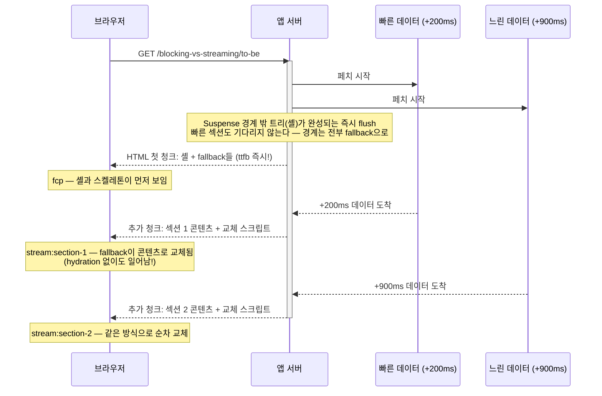

# 05. Streaming SSR — 셸 먼저, 느린 것은 나중에

> **한 줄 요약**: 페이지를 Suspense 경계로 섹션 단위로 쪼개, 준비된 셸을 즉시 보내고 느린 섹션은 같은 HTTP 응답 스트림으로 뒤늦게 흘려보낸다 — "가장 느린 데이터가 페이지 전체를 볼모로 잡는" 블로킹 SSR의 문제를 푼다.
>
> **선행 문서**: [03. SSR](./03-ssr.md)

## 동작 원리

셸은 **어떤 Suspense 경계도 기다리지 않고** 먼저 flush된다 — "빠른" 섹션의 콘텐츠도 별도의 후속 청크로 온다. (셸이 준비된 시점에 이미 resolve가 끝난 경계가 있다면 그 콘텐츠는 첫 청크에 포함될 수도 있다.)

세 가지 포인트:

1. **HTTP 응답은 하나다.** 여러 요청이 아니라 한 응답을 청크(chunk)로 나눠 보낸다(`renderToPipeableStream` / `renderToReadableStream`).
2. **교체는 hydration 이전에 일어난다.** 서버가 fallback을 실제 콘텐츠로 바꾸는 작은 인라인 스크립트를 함께 흘려보낸다. 그래서 이 시점은 `StageMark`(컴포넌트가 클라이언트에 마운트된 시점을 기록하는 일반 단계 마크 — hydration 이후에야 발화)가 아니라 **`StreamMark`(인라인 스크립트 기반, `stream:section-N`)로만 잡을 수 있다** — [docs/PERF_API.md](../PERF_API.md).
3. **Suspense 경계가 곧 절단선이다.** 경계를 어디에 두느냐가 UX 설계다. 너무 잘게 쪼개면 화면이 팝콘처럼 튄다(layout shift).

## 유리한 상황

- **속도가 다른 데이터가 섞인 페이지**: 목록(빠름) + 추천(느림) + 리뷰(느림). 전형적인 상세 페이지.
- **TTFB에 민감한 환경**: 셸은 데이터와 무관하게 즉시 나가므로 체감 시작이 빠르다.
- **긴 지연 환경**: 사용자는 스피너라도 "진행 중"임을 본다. 블로킹 SSR의 흰 화면보다 훨씬 낫다.

## 불리한 상황

- **페이지의 전부가 하나의 느린 데이터에 의존**: 쪼갤 것이 없으면 스트리밍해도 얻는 게 없다.
- **SEO에서 초기 HTML만 읽는 일부 크롤러**: 주요 크롤러는 스트리밍을 소화하지만, 핵심 콘텐츠를 fallback 뒤에 두는 것은 위험하다.

## 전형적 함정

1. **중간 인프라가 버퍼링하면 무효**: nginx의 `proxy_buffering`, 일부 CDN, 압축 미들웨어가 청크를 모았다가 한 번에 보내면 블로킹 SSR과 같아진다. "코드는 스트리밍인데 스트리밍이 안 되는" 대표 원인.
2. **응답 시작 후에는 HTTP 상태 코드·`Location` 헤더를 못 바꾼다(200 고정)**: 느린 섹션에서 404/redirect가 필요해지면 이미 200이 나간 뒤다. Next는 스트리밍 중의 `redirect()`/`notFound()`를 클라이언트 측 처리로 폴백시켜(스트림에 meta refresh 태그 등을 삽입) 기능적으로는 동작하게 해 주지만, HTTP 상태는 200으로 남는다 — SEO·비JS 환경을 생각하면 그런 판단은 셸 렌더 전에 끝내는 것이 원칙이다.
3. **Suspense 경계 = 코드 경계가 아니다**: 스트리밍은 HTML 도착 순서를 바꿀 뿐, JS 번들 크기는 그대로다. 번들은 [코드 분할](./08-client-rendering-optimizations.md)과 [RSC](./06-rsc.md)의 몫.
4. **fallback과 콘텐츠의 크기 차이**: 교체 시 레이아웃이 크게 튀면(CLS) 스켈레톤 크기를 실제 콘텐츠에 맞춰야 한다.

## 관련 데모

| 데모 | URL | 확인할 것 |
|---|---|---|
| Next 블로킹 (as-is) | [http://localhost:3000/blocking-vs-streaming/as-is](http://localhost:3000/blocking-vs-streaming/as-is) | `ttfb`가 가장 느린 섹션 데이터만큼 밀림. 흰 화면 구간 |
| Next 스트리밍 (to-be) | [http://localhost:3000/blocking-vs-streaming/to-be](http://localhost:3000/blocking-vs-streaming/to-be) | `ttfb`·`fcp` 즉시, `stream:section-1..N`이 순차 도착. **스냅샷 필름스트립에서 fallback→콘텐츠 교체 장면**을 볼 것 |
| Start deferred (미러 쌍) | [http://localhost:3001/blocking-vs-deferred/as-is](http://localhost:3001/blocking-vs-deferred/as-is) · [to-be](http://localhost:3001/blocking-vs-deferred/to-be) | 같은 문제를 Start는 deferred loader + `<Await>`로 푼다 — [11. Next vs Start](./11-next-vs-start.md) |

**실험 순서 제안**: to-be에서 HUD 프리셋 `2000ms` → `ttfb`/`fcp`는 그대로고 `stream:section-N`만 밀리는 것 확인. as-is에서 같은 프리셋 → `ttfb` 자체가 2초 밀림. 이어서 `npm run throttle -- --target http://localhost:3000 --profile slow3g`로 회선 전체를 조이면, 셸 HTML 전송조차 느려져 스트리밍의 이득이 어떻게 변하는지 볼 수 있다.

**더 가보기**: [SSG](./04-ssg-isr.md)의 정적 셸과 스트리밍의 "느린 구멍"을 한 페이지에서 합치려는 시도가 PPR이다 → [10. PPR · Islands · Resumability](./10-ppr-islands-resumability.md).

---

**다음 문서**: [06. RSC](./06-rsc.md)
