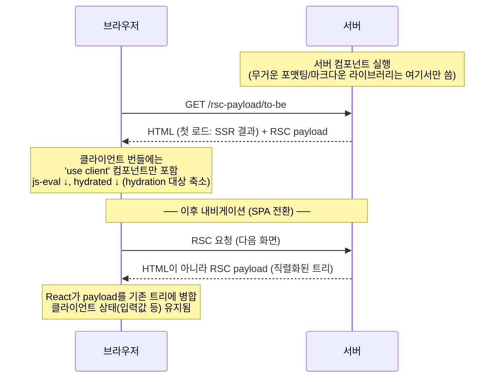

# 06. RSC — React Server Components

> **한 줄 요약**: 컴포넌트 단위로 "서버에서만 실행되는 컴포넌트"를 선언해, 그 코드와 의존 라이브러리를 **클라이언트 번들에서 아예 제거**하고 렌더 결과만 직렬화된 페이로드(RSC payload)로 보낸다 — 스트리밍이 "HTML 도착 순서"를 바꿨다면 RSC는 "보낼 JS의 양 자체"를 바꾼다.
>
> **선행 문서**: [05. Streaming SSR](./05-streaming-ssr.md), [07. Hydration](./07-hydration.md)

## 동작 원리



핵심 개념 세 가지:

1. **기본은 서버, `'use client'`가 경계**: Next App Router에서 컴포넌트는 기본적으로 서버 컴포넌트다. 상호작용(훅, 이벤트)이 필요한 지점에만 `'use client'`를 선언하며, 그 파일과 그 아래 import 트리가 클라이언트 번들에 들어간다. 이 규칙의 중요한 예외가 **조합(interleaving)**이다 — 클라이언트 컴포넌트가 `children`/props로 **전달받은** 서버 컴포넌트 출력은 번들로 끌려가지 않는다:

   ```tsx
   // ThemeProvider.tsx — 'use client' (상태·컨텍스트 때문에 클라이언트 경계)
   // layout.tsx — 서버 컴포넌트
   <ThemeProvider>
     <HeavyServerContent />  {/* children으로 전달 → 서버 컴포넌트로 유지됨 */}
   </ThemeProvider>
   ```
2. **서버 컴포넌트의 코드는 번들에 없다**: 마크다운 파서, 날짜/숫자 포맷터, ORM — 서버 컴포넌트에서만 쓰면 전송량 0. hydration 대상도 아니다(서버 컴포넌트 출력은 "이미 완성된 결과"로 취급).
3. **RSC payload는 HTML이 아니다**: React 트리의 직렬화 포맷(일명 Flight)이다. 내비게이션 시 HTML을 갈아끼우는 게 아니라 트리를 병합하므로 클라이언트 상태가 살아남는다. DevTools Network에서 `?_rsc=` 요청의 응답을 열어보면 이 포맷을 직접 볼 수 있다. 첫 로드에 HTML과 payload가 함께 오는 것은 중복이 아니다 — HTML은 첫 페인트용 결과물이고, payload는 React가 그 트리를 이어받아 관리(hydration·이후 내비게이션 병합)하기 위한 설계도로 역할이 다르다.

## 유리한 상황

- **표시 위주 + 무거운 변환 로직**: 마크다운/신택스 하이라이팅/i18n 포맷팅이 들어간 콘텐츠 페이지.
- **데이터 접근을 컴포넌트에 붙이고 싶을 때**: 서버 컴포넌트는 `async` 함수로 직접 데이터를 읽는다. props drilling 없이 컴포넌트가 자기 데이터를 소유.
- **저사양 기기 대상 서비스**: 보낼 JS와 hydration할 트리가 함께 줄어든다.

## 불리한 상황

- **화면 대부분이 상호작용**: 결국 대부분 `'use client'`가 되어 이득이 사라진다.
- **서버 왕복에 민감한 즉각 반응 UI**: 서버 컴포넌트의 갱신은 서버 왕복이 필요하다. 낙관적 UI·로컬 상태가 필요한 곳은 클라이언트 컴포넌트의 영역.

## 전형적 함정

1. **직렬화 경계**: 서버→클라이언트 컴포넌트로 넘기는 props는 직렬화 가능해야 한다. 깨지는 것은 일반 함수(단, `'use server'` Server Function은 예외적으로 전달 가능), 클래스 인스턴스 등 커스텀 프로토타입 객체, Symbol이다. 반대로 `Date`·`Map`·`Set`·`BigInt`·TypedArray·`Promise`는 Flight가 직렬화를 **지원**하므로 문자열로 바꿔 넘기는 우회가 필요 없다.
2. **경계 남발**: 트리 꼭대기 가까이에 `'use client'`를 붙이면 그 아래 전부가 클라이언트 번들행 — as-is 데모가 재현하는 상황. 경계는 가능한 한 잎(leaf) 쪽으로. Provider·테마 토글처럼 상단에 클라이언트 경계가 불가피하면 핵심 개념 1의 `children` 조합 패턴으로 서버 컴포넌트를 끼워 넣으면 된다.
3. **"RSC = SSR"이라는 오해**: RSC는 *어디서 실행되고 무엇을 보내는가*의 문제고, SSR은 *첫 HTML을 만드는가*의 문제다. RSC는 SSR 없이도(CSR 앱에서도) 성립하는 개념이며, Next에서는 둘이 결합되어 있을 뿐이다.
4. **서버 전용 값 유출**: 경계를 잘못 그으면 비밀 키가 클라이언트 번들에 들어갈 수 있다(`server-only` 패키지로 방지).

## 관련 데모

| 데모 | URL | 확인할 것 |
|---|---|---|
| 전부 클라이언트 (as-is) | [http://localhost:3000/rsc-payload/as-is](http://localhost:3000/rsc-payload/as-is) | 무거운 포맷팅 로직까지 클라이언트 번들에 포함. DevTools Network에서 JS 전송량, HUD에서 `js-eval`→`hydrated` 간격 |
| 서버 컴포넌트로 이동 (to-be) | [http://localhost:3000/rsc-payload/to-be](http://localhost:3000/rsc-payload/to-be) | 같은 화면인데 JS 전송량 감소, `hydrated`가 앞당겨짐. `?_rsc=` 응답(RSC payload) 직접 열어보기 |

**실험 순서 제안**: 두 페이지에서 DevTools Network를 열고 JS 리소스 합계를 비교 → HUD `JSON 복사`로 `js-eval`·`hydrated`를 비교 → `npm run throttle -- --profile slow3g`를 걸면 전송량 차이가 시간 차이로 증폭되는 것을 확인 ([12. 네트워크 조건](./12-network-conditions.md)).

---

**다음 문서**: [08. 클라이언트 렌더링 최적화](./08-client-rendering-optimizations.md) — 선행 문서인 [07. Hydration](./07-hydration.md)을 아직 안 읽었다면 그쪽부터.
