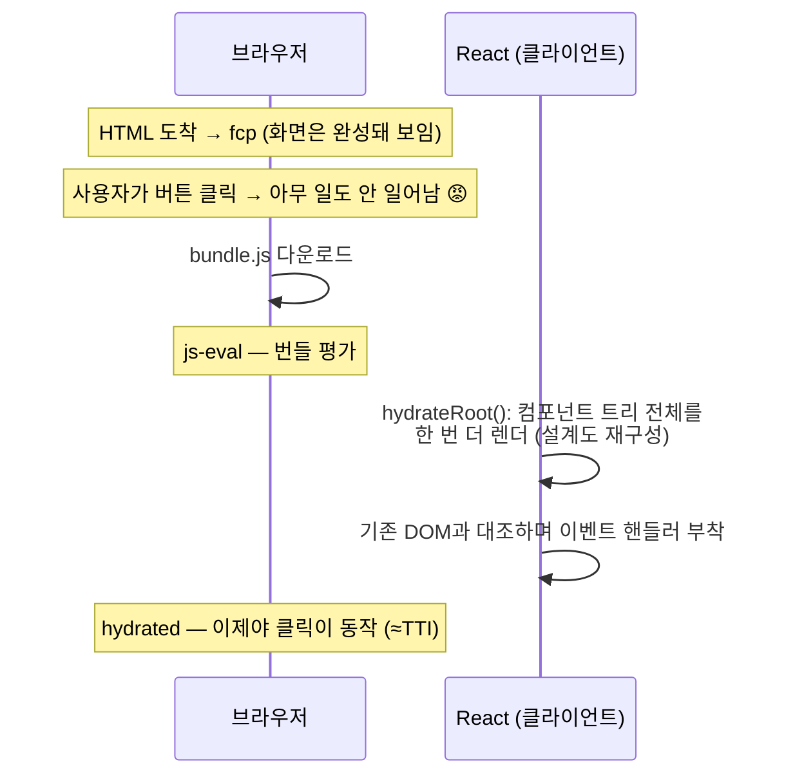

# 07. Hydration — SSR의 숨은 청구서

> **한 줄 요약**: 서버가 보낸 HTML은 "보이기만 하는 그림"이고, React가 클라이언트에서 트리를 다시 구성해 이벤트를 연결하는 hydration이 끝나야 비로소 앱이 된다 — SSR 계열 전략의 공통 비용이며, `fcp`와 `hydrated` 사이가 그 청구서다.
>
> **선행 문서**: [03. SSR](./03-ssr.md)

## 무슨 일이 일어나는가

hydration이 비싼 이유:

1. **렌더를 한 번 더 한다.** 서버가 이미 그린 화면인데, React는 이벤트를 붙일 대상을 알기 위해 같은 트리를 클라이언트에서 다시 계산해야 한다. CPU 비용은 CSR의 초기 렌더와 크게 다르지 않다.
2. **번들 전체가 필요하다.** 트리를 재구성하려면 모든 컴포넌트 코드가 있어야 한다. 즉 hydration 시작 시점은 번들 크기에 종속된다.
3. **동기적이고 길다.** 큰 트리의 hydration은 하나의 long task가 되기 쉽다. `long-tasks` 단계가 `hydrated` 직전에 튀는 이유.

재렌더에 쓰이는 데이터는 다시 fetch하는 것이 아니다. 서버가 렌더에 사용한 데이터를 HTML에 함께 직렬화해 내려보내고(Next의 RSC payload, Start의 dehydrated loader 데이터), 클라이언트는 그것을 재사용해 같은 트리를 재현한다 — mismatch가 나지 않는 이유이자, **payload 크기도 hydration 비용에 포함되는** 이유다. 직렬화 구조는 [06. RSC](./06-rsc.md) 참고.

## Uncanny valley — 보이는데 안 되는 구간

`fcp`(또는 `lcp`) ~ `hydrated` 사이, 화면은 완성돼 보이지만 무반응인 구간. 느린 회선일수록 이 구간이 길어지고, 사용자는 "빨리 뜨는데 버벅이는 사이트"라고 느낀다. **SSR의 체감 품질은 FCP가 아니라 이 구간의 길이로 결정되는 경우가 많다.**

## React 18+의 완화책: 선택적 hydration (Selective Hydration)

Suspense 경계로 나뉜 트리는 **경계 단위로 따로** hydrate된다.

- 스트리밍으로 늦게 도착한 섹션은 도착한 것부터 hydrate.
- 사용자가 아직 hydrate 안 된 영역을 클릭하면 **그 영역을 우선** hydrate (이벤트 리플레이).

즉 [05. Streaming SSR](./05-streaming-ssr.md)의 Suspense 경계는 HTML 도착 순서뿐 아니라 hydration 순서도 쪼갠다. 이 축의 극단이 [10. Islands와 Resumability](./10-ppr-islands-resumability.md)(hydrate할 영역 자체를 줄이거나, hydration을 아예 없애기)다.

## 전형적 함정

1. **Hydration mismatch**: 서버와 클라이언트의 렌더 결과가 다르면 경고가 뜨고, React가 트리를 클라이언트 기준으로 다시 그릴 수 있다(비용 2배). 주범: `Date.now()`·`Math.random()`, 브라우저 전용 API(`window`) 분기, 로케일/타임존 차이.
2. **"HTML이 왔으니 빠르다"는 착시**: FCP만 보면 SSR이 항상 이긴다. `hydrated`와 `worst-interaction`까지 봐야 공정하다 → [14. 측정 방법론](./14-measurement-methodology.md).
3. **숨겨진 상호작용 지연**: hydration 중 클릭은 씹히거나(React 17 이전) 밀린다. HUD의 `worst-interaction`이 페이지 로드 직후에 크게 찍히면 대개 hydration과 겹친 입력이다.
4. **"번들을 줄이면 hydration도 줄어든다"는 뭉뚱그림**: [08. 코드 분할](./08-client-rendering-optimizations.md)은 hydration의 '시작 시점'(`js-eval`)을 앞당길 뿐 작업량은 트리 크기 그대로다. hydrate할 '양' 자체를 줄이는 것은 [06. RSC](./06-rsc.md)처럼 컴포넌트를 클라이언트 트리에서 빼는 쪽이다 — 서로 다른 두 최적화를 구분할 것.

## 관련 데모

| 데모 | URL | 확인할 것 |
|---|---|---|
| 모든 SSR 데모의 `hydrated` | [http://localhost:3000/csr-vs-ssr/to-be](http://localhost:3000/csr-vs-ssr/to-be) | `fcp`~`hydrated` 간격. DevTools `Slow 3G`를 걸면 간격이 극적으로 벌어짐. 그 사이에 버튼을 클릭해 볼 것 |
| SSR 유무에 따른 hydration | [http://localhost:3001/selective-ssr/full](http://localhost:3001/selective-ssr/full) vs [/spa](http://localhost:3001/selective-ssr/spa) | full은 `fcp`에 이미 콘텐츠가 있지만 `ttfb`가 loader(400ms+apiDelay)에 볼모라 `fcp` 자체는 늦음. spa는 `ttfb`·`fcp`는 즉시(셸)지만 라우트 콘텐츠가 hydration 후 클라이언트에서 렌더되어 가장 늦음. spa도 셸 hydration은 있어 `hydrated`가 찍힌다 — 사라지는 것은 라우트 콘텐츠의 hydration뿐 (모드 의미는 [09](./09-selective-ssr-and-router-caching.md) 참고) |
| 번들 크기 → hydration | [http://localhost:3002/bundle-as-is.html](http://localhost:3002/bundle-as-is.html) vs [/bundle-to-be.html](http://localhost:3002/bundle-to-be.html) | `js-eval`→`hydrated`가 번들 크기에 어떻게 종속되는지 (react-lab은 CSR이라 여기서 `hydrated`는 mount 완료 — 번들 크기가 상호작용 가능 시점을 미루는 구조는 동일) |
| 스트리밍 + 선택적 hydration | [http://localhost:3000/blocking-vs-streaming/to-be](http://localhost:3000/blocking-vs-streaming/to-be) | `stream:section-N`(HTML 파서 도달 — hydration 이전)과 `hydrated`(hydration 완료)의 시차 |

---

**다음 문서**: [04. SSG와 ISR](./04-ssg-isr.md)
