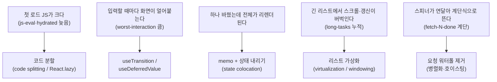

# 08. 클라이언트 렌더링 최적화 — 프레임워크 무관 전략

> **한 줄 요약**: 어떤 렌더링 전략을 쓰든 마지막 싸움은 클라이언트에서 벌어진다 — 코드 분할, useTransition/useDeferredValue, memo, 가상화, 워터폴 제거는 각각 "다른 증상"에 대한 처방이며, react-lab의 as-is/to-be 쌍이 각 증상을 재현한다.
>
> **선행 문서**: [01. 렌더링 파이프라인과 지표](./01-rendering-pipeline-and-metrics.md), [02. CSR](./02-csr.md)

## 증상 → 처방 지도

증상을 먼저 확인하고 처방하라. **증상 없는 최적화는 복잡도만 산다** (특히 memo).

## 1. 코드 분할 (Code Splitting)

첫 화면에 필요 없는 코드(모달, 에디터, 차트, 관리자 화면)를 `import()` 경계로 분리해 필요할 때 로드한다. `js-eval`이 앞당겨지고, SSR 앱이라면 [hydration](./07-hydration.md) 시작도 빨라진다.

- **데모**: [bundle-as-is.html](http://localhost:3002/bundle-as-is.html) (전부 한 번들) vs [bundle-to-be.html](http://localhost:3002/bundle-to-be.html) (초기 화면만 먼저)
- **확인할 것**: DevTools Network의 JS 전송량과 HUD `js-eval`·`hydrated`. `editor-requested`→`editor-ready` 같은 데모 고유 단계로 "지연 로드된 조각이 준비되는 시점"을 볼 것. slow3g 스로틀에서 차이가 증폭된다.
- **함정**: 사용 직전에야 로드하면 클릭 후 대기가 생긴다. hover/viewport 진입 시 프리로드와 조합할 것 ([09. preload intent](./09-selective-ssr-and-router-caching.md)와 같은 원리).

## 2. useTransition / useDeferredValue

상태 갱신을 **긴급(입력창 반영)과 비긴급(결과 목록 재계산)으로 분리**한다. 비긴급 렌더는 중단 가능해져, 타이핑이 무거운 렌더에 볼모잡히지 않는다.

두 API의 선택 기준: 상태 setter를 **내가 소유**하면 `startTransition(() => setState(v))`로 갱신 자체를 격하하고, 값을 props 등으로 **받기만** 해서 setter에 손댈 수 없으면 `useDeferredValue(value)`로 "한 박자 늦은 값"을 만들어 무거운 하위 렌더에 넘긴다.

- **데모**: [transition/as-is](http://localhost:3002/#/transition/as-is) (검색어 하나에 무거운 목록이 동기 리렌더) vs [to-be](http://localhost:3002/#/transition/to-be)
- **확인할 것**: 빠르게 타이핑하며 HUD `worst-interaction`(INP 근사)과 `long-tasks` 비교. as-is는 글자 입력 자체가 밀린다. 화면의 "입력 반응 지연(keydown→paint)" 숫자도 볼 것.
- **함정**: transition은 렌더를 빠르게 만드는 게 아니라 **양보하게** 만든다. 렌더 자체가 너무 무거우면 memo/가상화가 먼저다. 실제로 to-be 데모는 **transition + useDeferredValue + memo 3종 결합**이다 — 목록(`ItemList`)이 memo가 아니면 urgent 렌더(입력 글자 갱신)에서도 목록이 다시 렌더되어 "입력 즉시 반응"이 사라진다(§3과의 결합).

## 3. memo — 리렌더 범위 축소

부모가 리렌더될 때 props가 같은 자식은 건너뛴다(`React.memo`, `useMemo`, `useCallback`). 본질은 "상태 변경의 영향 범위를 줄이는 것"이므로, memo 이전에 **상태를 쓰는 곳 가까이로 내리는 것**(state colocation)이 먼저다.

- **데모**: [memo/as-is](http://localhost:3002/#/memo/as-is) (키 입력 하나·카드 클릭 한 번에 카드 500장이 전부 리렌더) vs [to-be](http://localhost:3002/#/memo/to-be)
- **확인할 것**: 화면의 "이번 입력으로 리렌더된 카드 수"(as-is는 매번 500)와 상호작용 시 `long-tasks`·`worst-interaction`. React DevTools Profiler로 리렌더 범위 시각화도 병행 추천.
- **함정**: 인라인 객체/함수 props가 memo를 무효화한다. 그리고 React Compiler가 이 최적화를 자동화하는 방향이므로, 수동 memo는 "측정으로 확인된 병목"에만.

## 4. 리스트 가상화 (Virtualization)

화면에 보이는 행만 DOM으로 만든다. 수천 행의 DOM 생성·레이아웃 비용과 메모리를 없앤다.

- **데모**: [virtual/as-is](http://localhost:3002/#/virtual/as-is) (스터디스페이스 10,000행 전부 렌더 — 행당 노드 5개, 총 5만 노드 이상) vs [to-be](http://localhost:3002/#/virtual/to-be)
- **확인할 것**: 초기 `content-rendered`까지의 시간과 `long-tasks`. as-is는 DOM이 스냅샷 한도 6,000 노드를 훌쩍 넘겨 목록 커밋 이후 **HUD 스냅샷이 생략**된다(📷 없음 — 그 자체가 "DOM이 너무 크다"는 신호다, [PERF_API](../PERF_API.md) 참고).
- **함정**: 가변 높이 행, 브라우저 내 검색(Ctrl+F) 불가, 접근성. "일단 페이지네이션으로 충분한가"를 먼저 물을 것.

## 5. 요청 워터폴 제거

컴포넌트가 렌더된 뒤에야 그 자식의 fetch가 시작되는 구조(fetch-on-render)는 지연을 **직렬로 합산**한다. 요청을 라우트 레벨로 끌어올리거나(hoisting) `Promise.all`로 병렬화한다.

- **데모**: [waterfall/as-is](http://localhost:3002/#/waterfall/as-is) (3개 지역 목록을 직렬 `await`로 순차 fetch — 마운트 후에야 첫 요청 시작) vs [to-be](http://localhost:3002/#/waterfall/to-be) (`Promise.all` 병렬 + 라우트 청크 로드 시점에 요청 선시작)
- **확인할 것**: HUD에서 `fetch-1-done`→`fetch-2-done`→`fetch-3-done`이 as-is는 계단(직렬), to-be는 거의 같은 시각에 몰려 있음. `data-requested`가 as-is는 `hydrated` **뒤**(렌더를 기다렸다 요청), to-be는 **앞**(render-as-you-fetch)에 찍히는 것도 볼 것. `?apiDelay=800`이면 as-is의 `all-done`은 지연×3만큼 밀린다.
- **함정**: 이 문제의 프레임워크 레벨 해법이 바로 라우트 loader([09](./09-selective-ssr-and-router-caching.md))와 서버 컴포넌트의 데이터 소유([06](./06-rsc.md))다 — 같은 원리가 계층만 바꿔 반복된다.

## 관련 데모 (모음)

- [http://localhost:3002/#/transition/as-is](http://localhost:3002/#/transition/as-is) · [to-be](http://localhost:3002/#/transition/to-be)
- [http://localhost:3002/#/memo/as-is](http://localhost:3002/#/memo/as-is) · [to-be](http://localhost:3002/#/memo/to-be)
- [http://localhost:3002/#/virtual/as-is](http://localhost:3002/#/virtual/as-is) · [to-be](http://localhost:3002/#/virtual/to-be)
- [http://localhost:3002/#/waterfall/as-is](http://localhost:3002/#/waterfall/as-is) · [to-be](http://localhost:3002/#/waterfall/to-be)
- [http://localhost:3002/bundle-as-is.html](http://localhost:3002/bundle-as-is.html) · [bundle-to-be.html](http://localhost:3002/bundle-to-be.html)

react-lab은 순수 CSR이라 CPU 병목이 그대로 드러난다. 상호작용 데모(transition/memo/virtual)는 네트워크보다 **DevTools Performance 탭의 CPU 스로틀(4x/6x slowdown)**과 조합할 때 차이가 가장 잘 보인다.

---

**다음 문서**: [09. Selective SSR과 라우터 캐싱](./09-selective-ssr-and-router-caching.md)
