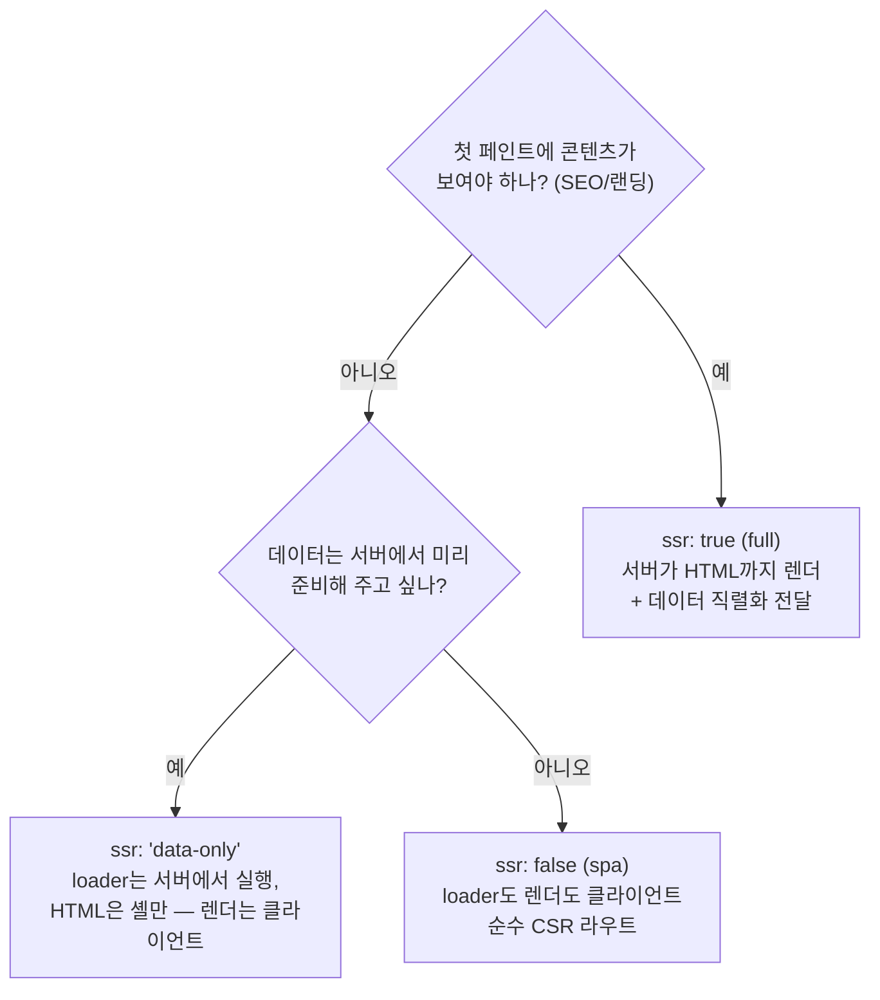
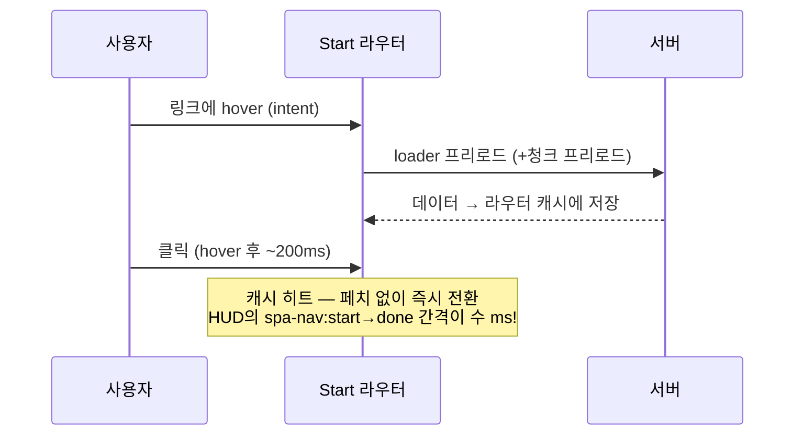

# 09. Selective SSR과 라우터 캐싱 — TanStack Start 고유 기능

> **한 줄 요약**: Start는 라우트마다 SSR 정도를 3단계(`ssr: true / 'data-only' / false`)로 고를 수 있고, 라우터 캐시(`staleTime`)와 의도 기반 프리로드(`preload: 'intent'`)로 SPA 내비게이션을 체감 0ms에 가깝게 만든다.
>
> **선행 문서**: [03. SSR](./03-ssr.md), [07. Hydration](./07-hydration.md)

## TanStack Start와 loader — 이 문서의 전제

TanStack Start는 SPA 라우터인 TanStack Router에 서버 실행(SSR·server function)을 더한 풀스택 프레임워크다 — 이 랩의 3001 포트(start-lab)가 Start 앱이다. 각 라우트는 **loader**를 가질 수 있는데, 라우트 진입 전에 실행되어 화면에 필요한 데이터를 준비하는 함수이며 컴포넌트는 `useLoaderData()`로 그 결과를 읽는다. loader는 **isomorphic**이다: 첫 문서 로드에서는 서버에서, 이후 SPA 내비게이션에서는 클라이언트에서 *같은 코드*가 실행된다. 이 문서는 그 위에 얹힌 Start 고유의 두 축 — 라우트별 SSR 선택, 라우터 캐시/프리로드 — 을 다룬다.

## Selective SSR — 라우트별 SSR 선택

Next가 "기본 SSR + 페이지가 동적이면 유지"라는 전역 모델이라면, Start는 **라우트 단위로 SSR을 명시적으로 선택**한다. `ssr` 옵션을 생략하면 기본값은 `true`(full)다.

| 모드 | 서버가 하는 일 | HUD 시그니처 | 어울리는 화면 |
|---|---|---|---|
| `full` | loader 실행 + HTML 렌더 | `ttfb`↑(데이터만큼), `fcp`에 콘텐츠, `hydrated` 대기 | 랜딩, 목록/상세, SEO 대상 |
| `data-only` | loader만 실행, 데이터를 직렬화해 셸과 함께 전송 | `ttfb`에 데이터 포함, `fcp`는 셸, 렌더는 JS 로드 후 — 단 **추가 데이터 왕복이 없다** | 로그인 뒤 첫 화면 (데이터는 급하고 SEO는 불필요) |
| `spa` | 셸만 서빙 | `ttfb`·`fcp` 즉시(셸), `content-rendered`는 `hydrated` + loader 뒤 — 라우트 콘텐츠의 hydration 대상이 없을 뿐 **셸 hydration은 존재**해 `hydrated` 마크가 찍힌다(순수 CSR [02](./02-csr.md)와의 차이) | 에디터, 대시보드 내부 화면 |

3개 변형을 나란히 보는 것이 이 데모의 핵심이다: [full](http://localhost:3001/selective-ssr/full) · [data-only](http://localhost:3001/selective-ssr/data-only) · [spa](http://localhost:3001/selective-ssr/spa)

## 라우터 캐싱 — staleTime과 gcTime

Start의 라우터는 loader 결과를 라우트 단위로 캐시한다. 수명 모델은 TanStack Query와 같은 2축이다: **staleTime = 신선 판정**, **gcTime = 보유 기간**.

- **`staleTime` 안**이면: 캐시를 그대로 쓰고 **loader를 다시 부르지 않는다** → 재방문 내비게이션이 즉시.
- **지나도(stale)**: 캐시가 살아 있으면(gcTime 내) 캐시를 먼저 보여주고 백그라운드에서 재검증한다(stale-while-revalidate — [ISR](./04-ssg-isr.md)과 같은 사상을 클라이언트 라우터에 적용한 것). 내비게이션 자체는 막히지 않는다.
- **`gcTime`까지 지나면**: 캐시가 버려져 다음 진입은 loader를 통째로 기다린다 — 첫 진입과 같다.

| 노브 | 역할 | 기본값 |
|---|---|---|
| `staleTime` | 신선 판정 — 이 시간 안이면 loader 스킵 | **0** (항상 stale → 재방문마다 백그라운드 재검증) |
| `gcTime` | 보유 기간 — 지나면 캐시 폐기 | 공식 문서상 30분 (설치된 router-core 1.131.50의 런타임 폴백은 5분) |
| `preloadStaleTime` | 프리로드된 데이터의 신선 판정 | 30초 |

## 프리로드 — preload: 'intent'

사용자가 링크에 **hover/터치 시작(의도, intent)**하는 순간 대상 라우트의 loader(코드 분할 청크 포함)를 미리 실행한다. hover→클릭 사이의 100~300ms를 데이터 페치에 재활용하는 것. 단, **기본은 꺼져 있다**(`defaultPreload: false`) — 라우터 옵션이나 `<Link preload="intent">`로 켜야 하며, 이 랩의 데모도 Link마다 명시해서 켠다.

## 전형적 함정

1. **"staleTime 0이라 뒤로가기가 느리다"는 착각**: 기본값(staleTime 0)에서도 캐시가 살아 있으면(gcTime 내) 뒤로가기는 즉시 뜨고 refetch는 백그라운드에서 돈다(SWR). 실제로 느려지는 것은 gcTime이 지나 캐시가 버려졌거나 첫 진입일 때다. as-is 데모는 이 "매번 기다리는" 경험을 재현하려고 **gcTime 0**으로 캐시를 아예 끈 인위적 구성이다. 반대로 staleTime을 너무 길게 주면 낡은 데이터(좌석 잔여 수!)를 보여준다.
2. **preload가 서버 부하를 만든다**: 같은 링크는 `preloadStaleTime`(기본 30초) 안에서는 재실행되지 않지만, 목록 페이지의 서로 다른 링크 수십 개는 각각 프리로드된다. 비싼 loader라면 의도적으로 끄거나 `preloadStaleTime`·`preloadDelay`(기본 50ms)로 조절해야 한다.
3. **`spa` 라우트에서 SEO 기대**: 셸만 나간다. 크롤러 대상 페이지는 `full`이어야 한다.
4. **loader와 렌더의 실행 위치 혼동**: `data-only`/`spa`에서 렌더는 클라이언트에서만 일어나므로 컴포넌트에서 `document` 등 브라우저 API는 안전하다(브라우저 전용 라이브러리 회피가 data-only의 용도이기도 하다). 반대로 `data-only`의 **loader는 여전히 서버에서 실행**되므로(`spa`는 loader도 클라이언트) loader 안에 브라우저 API를 넣으면 깨진다.

## 관련 데모

| 데모 | URL | 확인할 것 |
|---|---|---|
| Selective SSR 3형제 | [full](http://localhost:3001/selective-ssr/full) · [data-only](http://localhost:3001/selective-ssr/data-only) · [spa](http://localhost:3001/selective-ssr/spa) | 탭 3개로 열고 HUD `JSON 복사` → `ttfb`/`fcp`/`hydrated`/`content-rendered` 4개를 표로 비교. `?apiDelay=800`을 걸면: full·data-only는 `ttfb`가 밀리고, spa는 `content-rendered`가 밀린다 |
| 캐시 + 프리로드 as-is | [http://localhost:3001/cache-preload/as-is](http://localhost:3001/cache-preload/as-is) | 내비게이션마다 `spa-nav:start`→`spa-nav:done` 간격이 loader 지연만큼 벌어지고 스켈레톤이 다시 보임 (staleTime 0 + gcTime 0 — 캐시를 아예 끈 구성) |
| 캐시 + 프리로드 to-be | [http://localhost:3001/cache-preload/to-be](http://localhost:3001/cache-preload/to-be) | 링크에 hover만 하고 1초 뒤 클릭 → `spa-nav:start`→`spa-nav:done`이 수 ms, 즉시 전환. 재방문도 staleTime(데모는 60초) 내면 즉시 |

**실험 순서 제안**: to-be에서 hover 없이 키보드로만 이동해 보라(프리로드 미발동) — 캐시가 식은 상태의 첫 진입은 여전히 페치가 필요하다. 프리로드는 "의도가 보이는" 상호작용에만 효과가 있다는 한계까지 확인해야 이 기능을 제대로 이해한 것이다.

---

**다음 문서**: [11. Next vs Start](./11-next-vs-start.md) — Next와의 정면 비교
