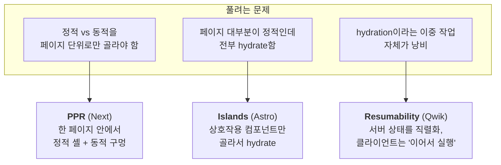

# 10. PPR · Islands · Resumability — 최전선의 세 가지 답

> **한 줄 요약**: 세 접근은 "**같은 일을 두 번 하지 않는다** — 특히 클라이언트가 다시 해야 하는 일을 0에 가깝게"라는 한 방향으로 수렴한다: Next PPR은 정적 셸을 빌드 때 미리 구워 요청 시 렌더를 동적 구멍만으로 줄이고, Astro Islands는 hydrate 대상을 상호작용 섬만으로 좁히며, Qwik Resumability는 hydration을 재개(resume)로 대체해 아예 없앤다 — 대가는 각각 Suspense 경계 설계(PPR), 섬 사이 상태 공유의 복잡성(Islands), React 생태계와의 결별(Qwik)이다.
>
> **선행 문서**: [05. Streaming SSR](./05-streaming-ssr.md), [07. Hydration](./07-hydration.md)
>
> ⚠️ **이 문서는 개념 전용이다. renderlab에 대응 데모가 없다.** (이 랩이 고정한 Next 15.5에서 PPR은 canary 전용 실험 플래그(`experimental.ppr`)였고, Next 16(2025-10)에서 그 플래그가 제거되며 **Cache Components(`'use cache'`)의 일부로 안정화**됐다 — 15.5 안정판 고정인 이 랩에는 데모를 넣지 않았고, 랩을 Next 16으로 올리면 next-lab에 `/ppr` 라우트로 추가할 수 있다. Astro/Qwik은 이 랩의 범위 밖이다.)

## 세 접근의 위치

세 접근은 같은 방향을 서로 다른 지점에서 공략한다 — PPR은 "정적/동적을 페이지 단위로만 골라야 한다"는 제약을, Islands는 "대부분 정적인데 전부 hydrate한다"는 낭비를, Resumability는 "hydration이라는 이중 작업" 자체를 겨눈다.

## PPR — Partial Prerendering (Next)

한 페이지를 **정적 셸(빌드 시 프리렌더, CDN 캐시 가능)**과 **동적 구멍(요청 시 스트리밍)**으로 나눈다. 경계는 스트리밍과 동일하게 **Suspense**다.

- 첫 바이트: 정적 셸이 CDN에서 즉시 (SSG급 TTFB — [04](./04-ssg-isr.md))
- 같은 응답 스트림으로 동적 부분이 이어서 도착 — 서빙 계층(CDN 또는 프레임워크 서버)이 캐시된 셸을 즉시 흘려보낸 뒤에도 **응답을 닫지 않고 열어 둔** 채, 요청 시 렌더가 끝난 동적 부분을 같은 스트림 뒤에 이어 붙이기 때문에 추가 왕복 없이 한 응답이 된다. fallback을 실제 콘텐츠로 교체하는 방식은 [05. Streaming](./05-streaming-ssr.md)과 동일 메커니즘
- 개념적으로 **"ISR + Streaming SSR을 한 페이지 안에 합친 것"**. renderlab의 두 축으로 말하면 "언제 렌더하나"를 페이지가 아닌 **섹션 단위로** 선택하는 것이다 — [09](./09-selective-ssr-and-router-caching.md)의 Start selective SSR이 같은 선택(정적/동적 혼합)을 **라우트 단위** 스위치로 내리는 것과 대비된다.
- 상태: Next 15까지는 canary 전용 실험 플래그(`experimental.ppr`)였고, Next 16(2025-10)에서 플래그가 제거되며 Cache Components(`'use cache'`)로 안정화됐다. 개념은 그대로 유효하니 API 세부는 최신 문서를 볼 것.

## Islands — Astro의 부분 hydration

페이지를 기본 **정적 HTML(JS 0)**로 굽고, 상호작용이 필요한 컴포넌트(섬, island)만 개별적으로 hydrate한다. 각 섬은 로드 전략을 따로 가진다(즉시/유휴 시/뷰포트 진입 시).

- [07. 선택적 hydration](./07-hydration.md)과의 차이: React의 선택적 hydration은 "전체를 hydrate하되 순서를 조절", Islands는 "**애초에 hydrate 대상이 아닌 영역**이 대부분".
- 콘텐츠 위주 + 산발적 상호작용(블로그, 문서, 커머스 상세)에서 강력하다. 섬들 사이 상태 공유가 필요해지는 순간 복잡해진다 — 각 섬이 독립된 hydration 루트(사실상 별개의 작은 앱)라서 컴포넌트 트리도 컨텍스트도 공유하지 않기 때문에, 섬을 가로지르는 상태는 전역 스토어나 커스텀 이벤트 같은 외부 통로를 타야 한다.

## Resumability — Qwik의 hydration 폐지

hydration이 비싼 근본 이유는 **서버가 한 일을 클라이언트가 다시 하기** 때문이다([07](./07-hydration.md)). Qwik은 서버 렌더 시점의 상태와 이벤트 배선을 HTML에 직렬화해 두고, 클라이언트는 재실행 없이 **중단된 지점부터 재개(resume)**한다. 이벤트 핸들러 코드도 실제 상호작용 시점에 지연 로드한다 — 핸들러가 아직 없는데도 클릭이 동작하는 이유는, 문서 전역에 리스너 하나만 걸어 두고 HTML 속성에 직렬화된 "핸들러 코드 위치"를 읽어 상호작용 순간에야 해당 코드를 로드·실행하기 때문이다.

- 그래서 초기 JS가 전역 리스너 수준의 상수(수 KB)가 되어, TTI가 페이지 크기와 거의 무관해진다.
- 대가: 전용 컴파일러와 프로그래밍 모델. React 생태계와의 호환이 아니라 대체다.

## 관계 정리

방향은 하나로 수렴한다: **"클라이언트가 다시 해야 하는 일을 0에 가깝게"**. RSC(보낼 코드 축소) → Islands(hydrate 영역 축소) → Resumability(hydration 제거)는 같은 축의 점진적 극단화이고, PPR은 거기에 "언제 렌더하나"(빌드+요청 혼합)라는 다른 축의 답을 겹친 조합이다. 아래 표가 그 좌표다.

| | 렌더 시점 | hydration | 경계 단위 |
|---|---|---|---|
| Streaming SSR ([05](./05-streaming-ssr.md)) | 요청 시 | 전체 (순서만 분할) | Suspense 섹션 |
| RSC ([06](./06-rsc.md)) | 요청 시(서버 부분) | 클라이언트 컴포넌트만 | `'use client'` 경계 |
| **PPR** | **빌드+요청 혼합** | 전체 | Suspense 섹션 |
| **Islands** | 빌드 시 위주 | **섬만** | 컴포넌트 |
| **Resumability** | 요청/빌드 | **없음** | 이벤트 핸들러 단위 |

## renderlab에서 유사 체험하기 (근사치)

데모는 없지만 다음 조합으로 감을 잡을 수 있다:

- PPR 근사: [SSG의 TTFB](http://localhost:3000/rendering-modes/ssg) + [스트리밍의 섹션 도착](http://localhost:3000/blocking-vs-streaming/to-be)을 각각 본 뒤 "한 페이지에 합쳐진다면"을 상상
- Islands 근사: [selective-ssr/full](http://localhost:3001/selective-ssr/full)에서 hydration 비용을 확인한 뒤, "페이지의 90%가 hydrate 대상에서 빠진다면 `hydrated`가 어디로 올까"를 추정

---

**다음 문서**: [12. 네트워크 조건](./12-network-conditions.md)
