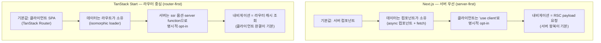

# 11. Next.js vs TanStack Start — 같은 문제, 두 철학

> **한 줄 요약**: Next는 "**서버 우선 RSC**"(컴포넌트가 서버에서 데이터를 소유하고, 클라이언트는 예외적으로 선언), Start는 "**라우터 중심 isomorphic loader**"(강력한 클라이언트 SPA 라우터에 서버 실행을 더함) — 미러 데모 쌍으로 두 철학이 같은 문제를 어떻게 다르게 푸는지 직접 비교한다.
>
> **선행 문서**: [03. SSR](./03-ssr.md), [05. Streaming SSR](./05-streaming-ssr.md), [06. RSC](./06-rsc.md), [09. Selective SSR](./09-selective-ssr-and-router-caching.md)

## 철학 비교

- **Next**: "서버에서 할 수 있는 일은 서버에서"가 기본값. 컴포넌트 트리 자체가 서버/클라이언트로 나뉜다. 무게중심이 서버에 있고, 클라이언트 상호작용이 예외 선언이다. 단, 내비게이션에서 클라이언트가 빈손인 것은 아니다 — `<Link>`가 뷰포트에 들어오면 자동 prefetch하고 결과를 클라이언트 Router Cache에 담아 서버 왕복을 숨긴다(무게중심이 서버라는 것이지, 클라이언트 최적화가 없다는 뜻이 아니다).
- **Start**: 완성형 SPA 라우터(TanStack Router)가 뼈대다. loader는 **isomorphic** — 첫 로드는 서버에서, 이후 내비게이션은 클라이언트에서 *같은 코드*가 실행된다. 무게중심이 클라이언트에 있고, 서버 개입이 선택 사항이다.

같은 as-is 문제("클라이언트 페치라 첫 화면이 늦다")에 대해 Next의 to-be는 "컴포넌트를 서버로 옮기자", Start의 to-be는 "페치를 loader로 올리자"인 이유가 여기 있다.

## 같은 문제를 푸는 방식 비교

| 문제 | Next 방식 | Start 방식 | 직접 비교할 데모 |
|---|---|---|---|
| **데이터 로딩** (첫 화면에 데이터를 어떻게 넣나) | async 서버 컴포넌트에서 직접 fetch — 데이터가 **컴포넌트에** 붙는다 | 라우트 `loader`에서 페치, 컴포넌트는 `useLoaderData()` — 데이터가 **라우트에** 붙는다 | next [/csr-vs-ssr/as-is](http://localhost:3000/csr-vs-ssr/as-is)·[to-be](http://localhost:3000/csr-vs-ssr/to-be) ↔ start [/loader-vs-client/as-is](http://localhost:3001/loader-vs-client/as-is)·[to-be](http://localhost:3001/loader-vs-client/to-be) |
| **스트리밍** (느린 데이터가 전체를 막지 않게) | `<Suspense>` 경계 + RSC — 느린 서버 컴포넌트가 나중에 스트림 | loader에서 promise를 **await하지 않고 반환**(deferred) + `<Await>`로 소비 | next [/blocking-vs-streaming/as-is](http://localhost:3000/blocking-vs-streaming/as-is)·[to-be](http://localhost:3000/blocking-vs-streaming/to-be) ↔ start [/blocking-vs-deferred/as-is](http://localhost:3001/blocking-vs-deferred/as-is)·[to-be](http://localhost:3001/blocking-vs-deferred/to-be) |
| **캐싱·내비게이션** | 무게중심은 서버: fetch 캐시·`revalidate`·태그 무효화(`revalidateTag` — 데이터에 태그를 달아 골라서 무효화) + 풀 라우트 캐시(렌더된 페이지 결과를 서버에 캐시, ISR의 저장소) — [04](./04-ssg-isr.md). **클라이언트에도** Router Cache + `<Link>` 자동 prefetch(뷰포트 진입 시, 프로덕션 기본)가 있다 | 무게중심은 클라이언트: 라우터 캐시 `staleTime`/`gcTime` + `preload: 'intent'`(hover 의도 기반 — Next의 뷰포트 트리거와 대비) — [09](./09-selective-ssr-and-router-caching.md) | 서버 캐시: next [/rendering-modes/isr](http://localhost:3000/rendering-modes/isr) ↔ start [/cache-preload/to-be](http://localhost:3001/cache-preload/to-be) · 내비게이션 미러: next [/prefetch-cache/as-is](http://localhost:3000/prefetch-cache/as-is) ↔ start [/cache-preload/as-is](http://localhost:3001/cache-preload/as-is) |
| **서버 전용 코드** | 서버 컴포넌트(기본) + Server Actions(`'use server'`) — 컴포넌트 경계가 곧 서버 경계 | `createServerFn()` — 클라이언트에서 호출 가능한 타입 안전 서버 함수(RPC 스타일) | 실물은 start 쪽만: [/cache-preload/as-is/1](http://localhost:3001/cache-preload/as-is/1)·[to-be/1](http://localhost:3001/cache-preload/to-be/1) — 상세 loader가 `createServerFn()`(`routes/cache-preload/-detail-server-fn.ts`)을 호출. next [/rsc-payload/to-be](http://localhost:3000/rsc-payload/to-be)는 "서버에 남는 코드"(서버 컴포넌트)의 실물일 뿐, `'use server'` Server Action 실물 데모는 next-lab에 없다(개념 대응만) |
| **SSR 제어** | 전역 기본 SSR. 정적/동적은 프레임워크가 페이지의 동적 입력 사용 여부로 판정 (opt-out이 어렵고 암묵적) | 라우트별 `ssr: true / 'data-only' / false` — 명시적 3단 스위치 | next [/rendering-modes/*](http://localhost:3000/rendering-modes/ssr) ↔ start [/selective-ssr/*](http://localhost:3001/selective-ssr/full) |

**미러 쌍을 보는 요령**: 두 to-be의 HUD `JSON 복사` 결과를 나란히 놓으면 도달 경로는 달라도 시그니처(`ttfb`에 데이터 포함, `fcp`에 콘텐츠)가 거의 같다. **전략의 층위(어디서·언제 렌더하나)가 같으면 프레임워크가 달라도 성능 특성이 수렴한다** — 이 랩 전체의 핵심 교훈 중 하나다.

## 선택 가이드

| 상황 | 추천 | 이유 |
|---|---|---|
| 콘텐츠·SEO 중심 (커머스, 미디어, 마케팅+앱 혼합) | **Next** | RSC로 번들·hydration 축소([06](./06-rsc.md)), ISR/PPR 등 정적화 스펙트럼이 넓다 |
| 앱 밀도가 높은 SPA (대시보드, 내부 도구, 에디터) + SEO 일부 | **Start** | 라우터 캐시·preload로 내비게이션 체감이 뛰어나고, 필요한 라우트만 `full` SSR |
| 팀이 "서버 위주 사고"에 익숙 (BE 겸업, 템플릿 렌더링 경험) | Next | 서버 우선 기본값이 사고방식과 일치 |
| 팀이 "클라이언트 상태·타입 안전" 중시 (TanStack Query/Router 사용 경험) | Start | 같은 생태계, loader/서버 함수까지 end-to-end 타입 추론 |
| Vercel 스타일 인프라 통합 vs 배포 유연성 | Next / Start | Next는 통합 최적화가 깊고, Start(Vite 기반)는 어댑터가 가볍다 |

어느 쪽이든 **렌더링 전략의 원리는 동일하다.** 이 위키의 02~08은 두 프레임워크 모두에 그대로 적용된다.

## 관련 데모

- 미러 쌍 1: [next /csr-vs-ssr](http://localhost:3000/csr-vs-ssr/as-is) ↔ [start /loader-vs-client](http://localhost:3001/loader-vs-client/as-is)
- 미러 쌍 2: [next /blocking-vs-streaming](http://localhost:3000/blocking-vs-streaming/as-is) ↔ [start /blocking-vs-deferred](http://localhost:3001/blocking-vs-deferred/as-is)
- 미러 쌍 3 (내비게이션 캐시·프리페치): [next /prefetch-cache](http://localhost:3000/prefetch-cache/as-is) ↔ [start /cache-preload](http://localhost:3001/cache-preload/as-is)
- Start 고유: [/selective-ssr/full](http://localhost:3001/selective-ssr/full)
- Next 고유: [/rendering-modes/isr](http://localhost:3000/rendering-modes/isr) · [/rsc-payload/to-be](http://localhost:3000/rsc-payload/to-be)

---

**다음 문서**: [10. PPR · Islands · Resumability](./10-ppr-islands-resumability.md)
