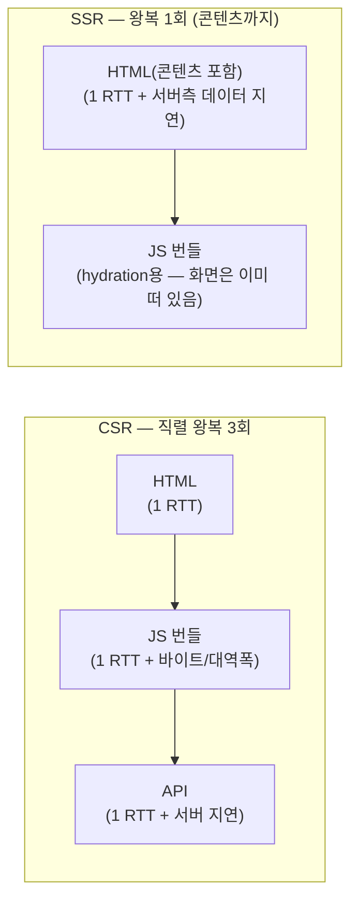

# 12. 네트워크 조건 — 회선이 전략의 승패를 바꾼다

> **한 줄 요약**: 지연(latency)이 크면 **왕복 횟수**가, 대역폭(bandwidth)이 좁으면 **전송 바이트**가 성능을 지배한다 — 같은 데모 쌍도 회선 프로파일에 따라 격차가 몇 배로 벌어지거나 뒤집히므로, 전략 평가는 반드시 여러 프로파일에서 해야 한다.
>
> **선행 문서**: [01. 렌더링 파이프라인과 지표](./01-rendering-pipeline-and-metrics.md), [02. CSR](./02-csr.md), [03. SSR](./03-ssr.md)

## 핵심 직관: 왕복 횟수 × RTT + 바이트 ÷ 대역폭

콘텐츠 도달 시간의 하한은 코드가 아니라 구조가 정한다: **직렬 왕복 횟수 × RTT + 전송 바이트 ÷ 대역폭**. CSR은 왕복 3회를, SSR은 1회를 구조적으로 깔고 시작한다.



- RTT 400ms(slow3g)라면: CSR은 콘텐츠까지 **최소 1200ms를 구조적으로** 깔고 시작한다. SSR은 400ms.
- 대역폭 250kbps(2g)라면: 500KB 번들 전송에만 **16초**. 이때는 왕복 횟수보다 [번들 크기](./08-client-rendering-optimizations.md)([RSC](./06-rsc.md), 코드 분할)가 지배한다.
- **"지연이 크면 왕복 횟수가 지배한다"** — 이 한 문장이 CSR→SSR→스트리밍→프리로드로 이어지는 진화의 절반을 설명한다. 나머지 절반은 "대역폭·CPU가 부족하면 바이트가 지배한다"(RSC·코드 분할·가상화).

## 프로파일 정의 (throttle proxy 기준)

`tools/throttle-proxy`의 프로파일 (`npm run throttle -- --profile <이름>`):

| 프로파일 | 왕복 지연 | 대역폭 | 현실 대응 |
|---|---|---|---|
| `wifi` | 5ms | 40,000kbps | 사무실/집 — **차이가 안 보이는 게 정상인 환경** |
| `4g` | 60ms | 9,000kbps | 도심 모바일 |
| `fast3g` | 150ms | 1,600kbps | 혼잡한 모바일, DevTools "Fast 3G"급 |
| `slow3g` | 400ms | 400kbps | 지하철·교외, DevTools "Slow 3G"급 |
| `2g` | 800ms | 250kbps | 최악 조건, 극단 검증용 |

## 전략 × 프로파일 유불리 매트릭스

결론은 두 가지다. **회선이 느릴수록 전략 간 격차가 벌어진다** — slow3g 열에서 CSR과 스트리밍 SSR의 격차가 최대이고, as-is/to-be 데모도 이 열에서 봐야 극적이다. 반대로 **wifi 행에서는 모든 전략이 대동소이하다** — **"내 맥북 + localhost에서 차이가 안 보인다"는 반론이 무의미한 이유**다([14. 측정 방법론](./14-measurement-methodology.md)). 아래 매트릭스가 그 근거다.

관점: 콘텐츠 기준 TTFB/FCP/TTI. ◎ 매우 유리 · ○ 무난 · △ 취약 · ✕ 심각.

| 전략 | wifi | 4g | fast3g | slow3g | 2g | 한 줄 이유 |
|---|---|---|---|---|---|---|
| CSR ([02](./02-csr.md)) | ○ | ○ | △ | ✕ | ✕ | 직렬 왕복 3회 + 번들 전체 다운로드가 RTT·대역폭 양쪽에 정비례로 얻어맞음 |
| 블로킹 SSR ([03](./03-ssr.md)) | ○ | ○ | ○ | △ | △ | 왕복 1회로 콘텐츠 도달은 유리하나, TTFB까지 **아무것도 없는 흰 화면**이라 지연이 클수록 체감 리스크 |
| SSG/ISR ([04](./04-ssg-isr.md)) | ◎ | ◎ | ◎ | ○ | ○ | 서버 렌더·데이터 페치가 0이라 TTFB 최소. 남는 약점은 hydration용 번들 전송(TTI)뿐 |
| 스트리밍 SSR ([05](./05-streaming-ssr.md)) | ○ | ◎ | ◎ | ◎ | ○ | 셸이 1 RTT에 즉시 오고 느린 데이터는 진행 표시와 함께 도착 — 느린 회선에서 체감 개선 폭이 가장 큼 |
| RSC ([06](./06-rsc.md)) | ○ | ○ | ◎ | ◎ | ◎ | 전송 바이트 자체를 줄이므로 대역폭이 좁을수록, 기기가 느릴수록 이득 증가 |
| Selective SSR `data-only` ([09](./09-selective-ssr-and-router-caching.md)) | ○ | ○ | △ | △ | ✕ | loader가 서버에서 돌고 데이터가 HTML에 실려 와(dehydration) API 왕복 1회를 아낌 — 단, 콘텐츠 렌더는 번들 도착+hydration 이후라 대역폭 병목은 그대로 |
| Selective SSR `spa` ([09](./09-selective-ssr-and-router-caching.md)) | ○ | ○ | △ | ✕ | ✕ | 셸만 서버가 주고 데이터는 클라이언트 fetch — CSR과 동일한 직렬 왕복 구조라 등급도 CSR 행과 같다 |
| 프리로드+라우터 캐시 ([09](./09-selective-ssr-and-router-caching.md)) ※ | ○ | ◎ | ◎ | ◎ | ○ | **내비게이션** 지표에 작용: RTT가 클수록 "hover 동안 미리 왕복"의 절약분이 커짐 |

※ 프리로드+라우터 캐시 행만 등급 기준이 다르다: 첫 로드가 아니라 **내비게이션 시 콘텐츠 도달**(링크 클릭 → 다음 화면) 기준이다. 첫 로드의 TTFB/FCP에는 작용하지 않는다.

## 재현 방법 3단계

세 계층은 흉내내는 범위가 다르다 ([PERF_API](../PERF_API.md)의 "네트워크 시뮬레이션 계층"):

1. **`?apiDelay=` 쿼리 (HUD 프리셋 0/200/800/2000ms)** — **데이터 응답만** 지연. 백엔드가 느린 상황의 시뮬레이션. 클릭 한 번으로 가장 간편, 구조적 차이(지연이 어느 단계에 흡수되는가) 관찰에 최적.
2. **DevTools Network 스로틀** — 브라우저가 HTML/JS/CSS/API **전체 회선**을 지연+대역폭 제한. 프리셋(Fast 3G/Slow 3G) 또는 커스텀. 단, 해당 탭에서만. 주의: DevTools 프리셋은 명세상 목표 지연에 내부 보정 배수를 적용해 실제로는 훨씬 큰 지연을 건다(Fast 3G ≈ 562.5ms, Slow 3G ≈ 2,000ms) — 같은 이름의 프록시 프로파일(150/400ms)과 절대값이 수 배 다르므로 **계층 간 절대값 비교는 금지**([14](./14-measurement-methodology.md)의 원칙과 연결).
3. **throttle proxy (`npm run throttle`)** — 프로세스 레벨 프록시라 **DevTools가 없는 RN WebView·실기기까지** 커버 ([13](./13-webview-performance.md)).

   ```bash
   # next-lab을 slow3g로 — 이후 http://localhost:4300 접속
   npm run throttle -- --target http://localhost:3000 --profile slow3g

   # 세부값 덮어쓰기 (지연 300ms + 800kbps)
   npm run throttle -- --target http://localhost:3001 --profile fast3g --latency 300 --kbps 800
   ```

   주의: 프록시는 HTML/JS/CSS/API를 전부 느리게 한다. as-is/to-be 체감 차가 가장 극명해지는 환경이다.

## 관련 데모

- 왕복 횟수 지배 확인: [csr-vs-ssr/as-is](http://localhost:3000/csr-vs-ssr/as-is) vs [to-be](http://localhost:3000/csr-vs-ssr/to-be)를 DevTools Slow 3G에서 — wifi에서의 차이와 비교
- 바이트 지배 확인: [bundle-as-is.html](http://localhost:3002/bundle-as-is.html) vs [bundle-to-be.html](http://localhost:3002/bundle-to-be.html)을 `--profile 2g` 프록시 뒤에서
- 진행 표시의 가치: [blocking-vs-streaming](http://localhost:3000/blocking-vs-streaming/as-is) 쌍을 `--profile slow3g`에서 — 같은 총 소요 시간이라도 체감이 다름

---

**다음 문서**: [13. WebView 성능](./13-webview-performance.md)
