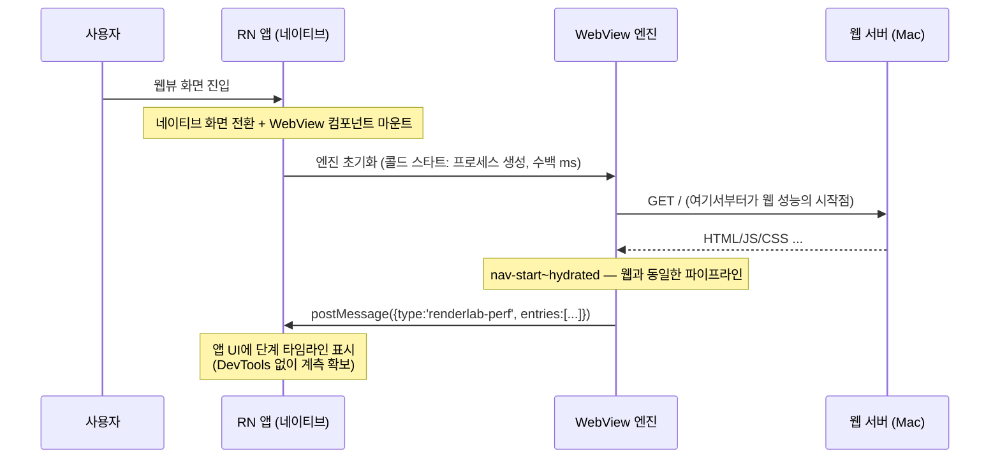

# 13. WebView 성능 — RN 웹뷰라는 특수 환경

> **한 줄 요약**: RN WebView는 "느린 브라우저"가 아니라 **콜드 스타트·엔진 파편화·브리지 비용·DevTools 부재**라는 고유 특성을 가진 별도 환경이며, renderlab은 HUD의 postMessage 전송으로 이 환경에서도 동일한 단계 계측을 가능하게 한다.
>
> **선행 문서**: [01. 렌더링 파이프라인과 지표](./01-rendering-pipeline-and-metrics.md), [12. 네트워크 조건](./12-network-conditions.md)

## 웹 브라우저와 무엇이 다른가



| 특성 | 내용 | 조심할 것 |
|---|---|---|
| **콜드 스타트** | 웹뷰 엔진 초기화가 첫 요청 **이전에** 수백 ms를 먹는다. 웹의 `nav-start` 기준 지표에는 안 잡힌다 | "웹에서 1초인데 앱에서 2초"의 상당분은 렌더링 전략과 무관한 네이티브 구간. 전략 비교는 **웹뷰 내부 단계끼리** 해야 공정 |
| **iOS WKWebView** | 별도 프로세스에서 실행, Safari와 같은 WebKit. JIT 허용으로 JS는 빠른 편 | 앱 내 첫 웹뷰 생성이 특히 비쌈. 프로세스 풀 워밍업 여부에 따라 편차 큼 |
| **Android WebView** | 시스템 Chromium 기반이지만 **기기·OS별 버전 파편화**가 심함 | 저가 기기 + 구버전 WebView 조합이 실사용자 최악 케이스. CPU 스로틀 테스트 필수 |
| **캐시** | 웹뷰 캐시 정책이 앱 설정에 종속. 앱 재시작·웹뷰 파괴 시 메모리 캐시 소실 | "재방문은 빠르다" 가정이 앱에서는 자주 깨진다. 첫 방문 성능의 비중이 웹보다 크다 → SSR·SSG 계열이 상대적으로 더 유리 |
| **JS 성능·메모리** | 모바일 CPU + 앱과 메모리 경쟁. 큰 번들 평가·hydration이 데스크톱 대비 수 배 느림 | [번들 축소](./08-client-rendering-optimizations.md)·[RSC](./06-rsc.md)·[가상화](./08-client-rendering-optimizations.md)의 이득이 증폭됨 |
| **브리지 비용** | 웹↔네이티브 통신(postMessage)은 JSON 직렬화를 동반 | 고빈도 전송은 그 자체가 성능 오염. renderlab HUD는 250ms 스로틀 + load 후 1.2초에 `final: true` 1회로 설계됨 ([PERF_API](../PERF_API.md)) |
| **DevTools 부재** | 실기기 웹뷰에는 Network 탭·스로틀이 없다 (원격 디버깅은 가능하나 번거로움) | 계측은 HUD postMessage로, 스로틀은 **throttle proxy로** 해결 |

## rn-webview 앱으로 측정·비교하는 절차

1. **준비**
   ```bash
   npm run demo          # 프로덕션 모드 필수 (터미널 1)
   npm run setup:rn
   cd apps/rn-webview && npx expo start   # 터미널 2
   ```
2. **Mac의 LAN IP 확인** — 기기에서 `localhost`는 기기 자신이다.
   ```bash
   ipconfig getifaddr en0   # 예: 192.168.0.10
   ```
3. **기기 연결** — Expo Go로 QR 스캔(같은 Wi-Fi 필수). 안 되면 `npx expo start --tunnel` — 단, tunnel은 **앱(Expo 번들) 로딩만** 해결한다. 측정 대상인 랩 서버(`http://<LAN IP>:3000` 등)는 여전히 기기가 Mac과 같은 네트워크여야 접근되고, tunnel 모드에서는 `hostUri`가 exp.direct 도메인이 되어 호스트 IP 자동 감지도 동작하지 않으므로 4단계에서 IP를 직접 입력해야 한다.
4. **앱의 설정+카탈로그 화면에서 데모 선택** — 호스트 IP는 Expo `hostUri`에서 자동 감지된다(필요하면 직접 수정). 포트 프리셋(3000/3001/3002/4300)·apiDelay 프리셋(0/200/800/2000ms)을 고른 뒤 카탈로그에서 데모를 탭하면 예: `http://192.168.0.10:3000/csr-vs-ssr/as-is` 가 웹뷰로 열린다. 페이지의 PerfHUD가 `window.ReactNativeWebView`를 감지하면 자동으로 `renderlab-perf` 메시지를 postMessage하고, 앱의 측정 화면에서 단계 타임라인을 확인한다.
5. **as-is/to-be 비교** — 같은 URL의 쌍을 번갈아 로드. **각 3회 이상, 중앙값으로** 비교하고([14](./14-measurement-methodology.md)), 웹뷰를 재생성하는 방식(화면 재진입)으로 캐시 상태를 통일한다. 단, 웹뷰 재생성으로 리셋되는 것은 **메모리 캐시뿐**이고 디스크 캐시(iOS WKWebsiteDataStore, Android HTTP 캐시)는 남는다 — 엄밀한 cold 반복은 앱 데이터 삭제 또는 URL 쿼리 버스팅으로 ([14. 원칙 2](./14-measurement-methodology.md)).
6. **회선 스로틀** — 기기에는 DevTools가 없으므로 프록시를 쓴다 (터미널 3).
   ```bash
   npm run throttle -- --target http://localhost:3000 --profile slow3g
   # 기기에서는 http://192.168.0.10:4300 으로 접속
   ```

수신 메시지 포맷(요약 — 전체는 [PERF_API](../PERF_API.md)):

```json
{
  "type": "renderlab-perf",
  "app": "next-lab",
  "url": "/csr-vs-ssr/as-is?apiDelay=800",
  "apiDelay": 800,
  "final": false,
  "entries": [{ "name": "ttfb", "t": 132.4, "detail": "..." }]
}
```

## 이 환경에서 다시 보는 전략 유불리

- **첫 방문이 반복된다**(캐시 소실) → SSR/SSG처럼 첫 페인트가 빠른 전략의 가치 상승.
- **CPU가 느리다** → hydration·번들 평가 비용 증폭 → RSC/코드 분할의 가치 상승, CSR 불리.
- **회선이 나쁠 확률이 높다** → [12. 네트워크 조건](./12-network-conditions.md)의 slow3g 열이 사실상 기본값이라고 생각할 것.

## 관련 데모

- 웹뷰에서 미러 쌍 비교: `http://<LAN IP>:3000/csr-vs-ssr/as-is` ↔ `to-be` (데스크톱 결과와 격차 폭 비교)
- 번들 데모를 웹뷰 + `--profile slow3g` 프록시로: `http://<LAN IP>:4300/bundle-as-is.html` (react-lab을 타깃으로 프록시 재기동)
- 데스크톱 대조군: 같은 페이지를 Mac 브라우저 + DevTools CPU 4x slowdown으로 열어 웹뷰 결과와 나란히 보기

---

**다음 문서**: [14. 측정 방법론](./14-measurement-methodology.md)
