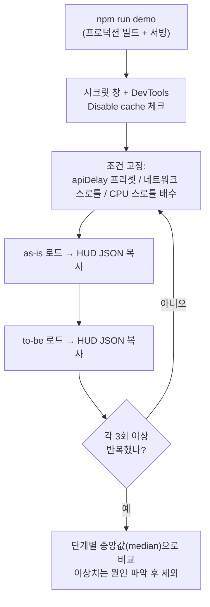

# 14. 측정 방법론 — 재는 법이 틀리면 전부 무효다

> **한 줄 요약**: 프로덕션 빌드·캐시 통제·3회 이상 중앙값·계측 오버헤드 인지·lab과 field의 구분 — 이 다섯 가지가 지켜지지 않은 비교는 어떤 결론도 뒷받침하지 못한다.
>
> **선행 문서**: [01. 렌더링 파이프라인과 지표](./01-rendering-pipeline-and-metrics.md) — 사실상 모든 데모를 보기 전·후에 읽어야 하는 문서다.

## 표준 측정 절차

"조건 고정"에는 **CPU 스로틀 배수**(DevTools Performance 탭 4x/6x)도 포함된다 — 상호작용 데모([08](./08-client-rendering-optimizations.md))와 웹뷰 대조 측정([13](./13-webview-performance.md))은 CPU 조건이 다르면 재현이 깨진다.

## 원칙 1 — 반드시 프로덕션 빌드 (`npm run demo`)

dev 모드가 왜곡하는 것들:

| dev 모드 요소 | 왜곡 |
|---|---|
| 미압축·미최적화 번들, dev 전용 코드 | `js-eval`·`hydrated`가 수 배 부풀어 CSR/hydration 비용 과대평가 |
| React 개발 빌드 (경고·검증 로직, StrictMode 이중 렌더) | 렌더 시간·`long-tasks` 과대측정 |
| HMR 웹소켓, 요청별 온디맨드 트랜스파일 | 네트워크·TTFB 노이즈 |
| **SSG/ISR이 동작하지 않음** (매 요청 렌더) | [04](./04-ssg-isr.md)의 렌더링 모드 비교가 아예 무의미해짐 |

dev 모드는 "동작 확인"용이고, **숫자를 읽는 순간부터는 `npm run demo`**다.

## 원칙 2 — 캐시 상태 통제

- **무엇을 재는지 먼저 정한다**: 첫 방문(cold)인가 재방문(warm)인가. 둘은 다른 실험이다.
- cold: 시크릿 창 + DevTools Network의 **Disable cache**. warm: 한 번 로드 후 새로고침, Disable cache 해제.
- as-is와 to-be는 **같은 캐시 상태**에서 비교한다. 한쪽만 warm이면 번들 크기 차이가 통째로 숨는다.
- [라우터 캐시](./09-selective-ssr-and-router-caching.md)·ISR 캐시는 HTTP 캐시와 별개고, 리셋 수단도 다르다: 라우터 캐시는 인메모리라 **페이지 전체 리로드**로 리셋되고(시크릿 창 여부와 무관), 시크릿 창은 **HTTP 캐시** 통제 수단이다. cache-preload 데모는 "라우터 캐시가 있는 상태"가 측정 대상이므로, 전체 리로드가 곧 라우터 캐시 초기화라는 점을 역이용할 것.

## 원칙 3 — 3회 이상, 중앙값

- 1회 측정은 측정이 아니다. JIT 워밍업, GC, OS 스케줄링, 프록시 타이밍으로 수십~수백 ms가 흔들린다.
- **평균이 아니라 중앙값(median)**: 한 번의 GC 스파이크가 평균을 오염시킨다. 이상치는 버리되, 반복되는 이상치는 그 자체가 발견이다(예: ISR 재검증 히트).
- HUD의 `JSON 복사`로 회차별 결과를 모아 스프레드시트에서 비교하는 것을 권장.

## 원칙 4 — 계측 자체의 오버헤드를 안다

HUD도 공짜가 아니다 ([PERF_API](../PERF_API.md)의 "스냅샷의 한계"):

- **스냅샷 캡처는 단계마다 수 ms**를 쓴다. as-is/to-be 모두 같은 계측을 달고 있으므로 *비교*는 공정하지만, *절대값*은 그만큼 부풀어 있다.
- DOM 6,000노드/800KB 초과 시 캡처가 자동 생략된다(📷 없음). 정밀 측정이 필요하면 `perfInit({ captureSnapshots: false })`.
- 스냅샷 캡처는 rAF 2회 뒤에 수행되므로, 스냅샷이 보여주는 화면은 해당 단계 "직후 프레임"이다.
- RN 브리지 전송은 250ms 스로틀이 걸려 있지만, 고빈도 커스텀 단계를 남발하면 그 자체가 오염원이다.

## 원칙 5 — lab 데이터와 field 데이터의 구분

- HUD는 **lab 계측**이다: 내 기기·내 회선·내 시나리오. 통제된 비교(as-is vs to-be)에 강하다.
- 실서비스 판단은 **field 데이터(RUM)** — 실제 사용자 분포의 LCP/INP(p75) — 로 해야 한다. lab에서 이긴 전략이 field에서 지는 일은 흔하다(사용자 기기·회선 분포가 내 맥북과 다르므로 — [12](./12-network-conditions.md), [13](./13-webview-performance.md)).
- 이 랩의 목적은 "전략 간 구조적 차이의 이해"이지 "우리 서비스의 실측"이 아니다.

## 잘못 재면 이렇게 속는다 — 사례집

| 함정 | 무슨 일이 벌어지나 | 교정 |
|---|---|---|
| dev 모드로 SSR vs CSR 비교 | dev의 온디맨드 트랜스파일이 TTFB를 부풀려 **SSR이 불리하게 조작**된 비교가 됨 | `npm run demo` |
| FCP만 보고 판정 | CSR의 빈 셸도 FCP를 찍는다 — "CSR이 더 빠르네?" | `content-rendered`·LCP·`hydrated`까지 [4개 지표 세트](./01-rendering-pipeline-and-metrics.md)로 |
| LCP를 이른 시점에 읽음 | LCP는 **갱신형** — 큰 이미지가 늦게 오면 값이 바뀐다. 이른 스크린샷의 LCP는 가짜 | 로드 완료 후 최종값 사용 (HUD는 갱신형 표기) |
| 한쪽만 캐시 warm | 번들 300KB 차이가 0ms로 보임 | 캐시 상태 통일 (원칙 2) |
| wifi에서만 비교 | "차이 없는데?" — [12](./12-network-conditions.md)의 wifi 행은 원래 다 비슷하다 | slow3g·CPU 스로틀에서 재비교 |
| 평균으로 비교 | GC 스파이크 1회가 결론을 뒤집음 | 중앙값 + 반복 |
| 스냅샷 켠 채 절대값 인용 | "hydration이 23ms 걸림" — 그중 수 ms는 계측 비용 | 절대값 인용 시 `captureSnapshots: false`로 재측정 |
| 탭 여러 개로 동시 측정 | 탭끼리 CPU·네트워크를 경쟁해 양쪽 다 오염 | 측정 탭 하나만 활성 |

## 관련 데모

- 어느 데모든 이 절차의 연습장이 된다. 추천 입문: [csr-vs-ssr](http://localhost:3000/csr-vs-ssr/as-is) 쌍으로 "dev vs demo 모드", "wifi vs slow3g", "1회 vs 중앙값"을 각각 바꿔가며 결론이 얼마나 흔들리는지 직접 확인해 보라.
- 계측 계약 전문: [docs/PERF_API.md](../PERF_API.md)

---

**처음으로**: [00. 색인](./00-index.md) — 권장 학습 경로의 끝이다. 색인에서 빠뜨린 문서를 확인하라.
